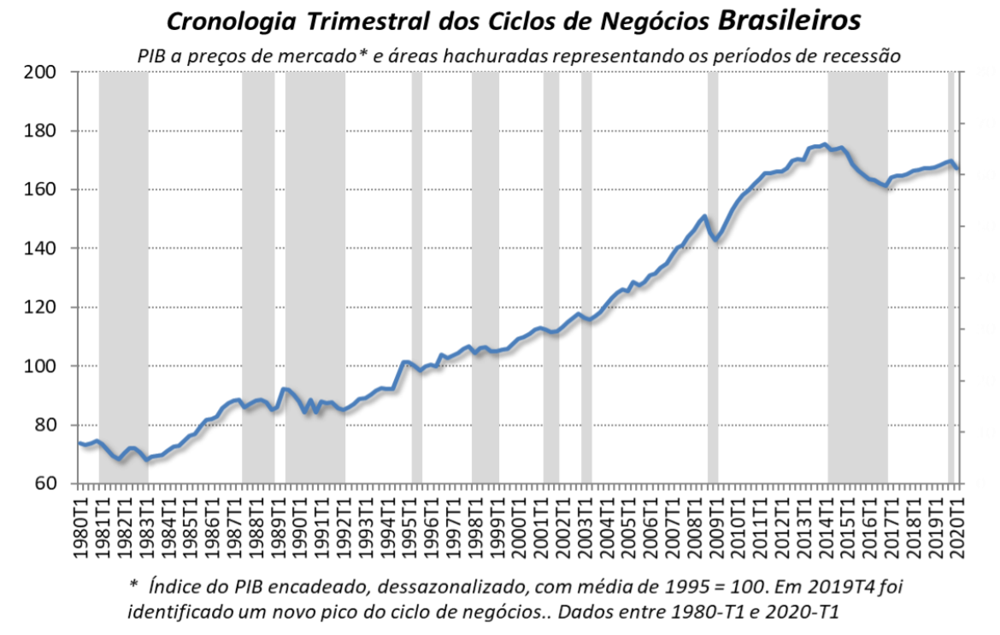

```{r setup, include=FALSE}
# Configurações dos chunks (outputs / saídas)
knitr::opts_chunk$set(
  echo       = TRUE,    # não mostrar código
  eval       = TRUE,     # executar o código
  fig.cap    = "",       # título do gráfico
  results    = "markup",   # formato de renderização de texto
  fig.align  = "center", # alinhamento horizontal do gráfico
  out.width  = "100%",   # redimensionamento do gráfico (aumentar/diminuir em %)
  warning    = FALSE,    # exibir avisos do console?
  message    = FALSE,    # exibir mensagens do console?
  size       = "tiny"    # tamanho da fonte
  )
# 
# # Padrão de gráficos
# library(ggplot2)   # CRAN v3.3.5 # CRAN v3.3.5
# theme_am <- function() {
#   ggthemes::theme_clean() %+replace%
#     ggplot2::theme(
#       plot.background   = ggplot2::element_rect(colour = NA),
#       legend.background = ggplot2::element_rect(colour = NA),
#       strip.text        = ggplot2::element_text(size = 8, face = "bold")
#     )
#   }
# ggplot2::theme_set(theme_am())
```

\newpage

# Introdução

Ao longo do tempo a economia apresenta o que se chama de ciclos econômicos, ou seja, períodos de expansão e recessão. Mas de que forma podemos saber **em qual ponto do ciclo econômico a economia se encontra**? Como sabemos se a economia está em recessão? Estas são perguntas de grande interesse para acadêmicos e profissionais da área, e neste breve exercício demonstramos como replicar a datação de ciclos econômicos que instituições como [NBER](https://www.nber.org/) (EUA) e [CODACE](https://portalibre.fgv.br/codace) (Brasil) tradicionalmente publicam.

\bigskip

De maneira prática, neste exercício replicamos o algoritmo de Harding & Pagan (2002) para datar o ciclos de negócios do Produto Interno Bruto (PIB) brasileiro. Em resumo, o método considera algumas regras impostas ao comportamento de uma série temporal para classificar picos e vales. Recessão é o período entro o pico da atividade econômica e seu subsequente vale, ou ponto mínimo. Entre o vale e o pico, diz-se que a economia está em expansão.

\bigskip

O método é bastante simples e poderoso, conseguindo praticamente replicar a cronologia de recessões desenvolvidas pelas instituições mencionadas acima.

# Pacotes

Para aplicar o algoritmo utilizaremos o pacote `BCDating` na linguagem R, criado por Majid Einian (Central Bank of Islamic Republic of Iran) e Franck Arnaud (National Institute of Statistics and Economic Studies, France). Outros pacotes são utilizados para coleta, tratamento e visualização de dados:

\bigskip

```{r}
# Carregar pacotes
library(magrittr)    # CRAN v2.0.1
library(BCDating)    # CRAN v0.9.8
library(sidrar)      # CRAN v0.2.6
library(dplyr)       # CRAN v1.0.7
library(lubridate)   # CRAN v1.7.10
library(timetk)      # CRAN v2.6.1
library(zoo)         # CRAN v1.8-9
library(ggplot2)     # CRAN v3.3.5
library(ggthemes)    # CRAN v4.2.0
library(ggtext)      # CRAN v0.1.1
library(purrr)       # CRAN v0.3.4
library(tidyr)       # CRAN v1.1.3
library(flextable)   # CRAN v0.6.1
```

# Dados

Neste exercício utilizaremos a série do PIB a preços de mercado (série encadeada do índice de volume trimestral com ajuste sazonal, média de 1995 = 100), disponível no SIDRA/IBGE. Para coletar os dados via API pode-se usar o pacote `sidrar`, especificando o código de coleta. Além disso realizamos a preparação dos dados para utilização posterior:

\bigskip

```{r}
# Coleta e tratamento de dados
pib <- sidrar::get_sidra(api = "/t/1621/n1/all/v/all/p/all/c11255/90707/d/v584%202") %>% 
  dplyr::select("date" = `Trimestre (Código)`, "value" = `Valor`) %>% 
  dplyr::mutate(value = value, date = lubridate::yq(date)) %>% 
  dplyr::as_tibble()

# Inspeção dos dados
pib
```

# Algoritmo de Harding & Pagan (2002)

Para aplicar o algoritmo e obter as datações de ciclo de negócios, primeiro transformamos o objeto pro formato de série temporal e, em seguida, utilizamos a função `BBQ()` do pacote `BCDating`. Optamos por deixar com os valores predefinidos os demais argumentos da função, que servem para definir os valores mínimos de duração do ciclo (pico ao pico ou vale ao vale) e da fase do ciclo (pico ao vale ou vale ao pico).

\bigskip

```{r}
# Obter datação de ciclo de negócios
bc_dates <- pib %>% 
  timetk::tk_ts(select = value, start = c(1996, 1), frequency = 4) %>% 
  BCDating::BBQ(name = "Ciclo de Negócios do PIB do Brasil")

# Inspeção do objeto
class(bc_dates)
```

# Resultados

Como pode ser visto abaixo, o objeto retornado traz como resultado as datas (trimestres) de picos e vales, assim como a duração do ciclo.

\bigskip

```{r}
# Exibir resultados
show(bc_dates)
```

\bigskip

Outras informações podem ser obtidas com a função `summary()`:

\bigskip

```{r}
# Informações adicionais
summary(bc_dates)
```

\bigskip

Porém, o mais interessante é avaliar o resultado visualmente através de um gráfico. Para tal, fazemos um tratamento dos dados retornados pela função `BBQ()` e utilizamos o `ggplot2` para gerar o gráfico com as áreas sombreadas referente às datas de recessão que foram identificadas pelo algoritmo, acompanhadas do comportamento do PIB no período:

\bigskip

```{r}
# Transformar resultados em tibble
bc_dates_tbl <- purrr::quietly(show)(bc_dates)$result %>% 
  dplyr::as_tibble() %>% 
  dplyr::mutate(
    `Peaks`   = zoo::as.yearqtr(`Peaks`), 
    `Troughs` = zoo::as.yearqtr(`Troughs`)
    )

# Formatar dados do PIB para "year/quarter"
pib %<>% 
  dplyr::mutate(date = zoo::as.yearqtr(date))

# Gerar gráfico
ggplot2::ggplot() +
  ggplot2::geom_rect(
    data = bc_dates_tbl, 
    ggplot2::aes(
      xmin = `Peaks`, xmax = `Troughs`, ymin = -Inf, ymax = Inf, 
      fill = "Recessão"
      ),
    alpha = 0.3
    ) +
  ggplot2::geom_line(
    data = pib, 
    ggplot2::aes(x = date, y = value, colour = "PIB s. a. (1995 = 100)"), 
    size = 1.5
    ) +
  ggplot2::labs(
    title    = "Datação de ciclos econômicos: PIB vs. Recessões",
    subtitle = "Recessão datada pelo algoritmo de Harding-Pagan (2002)",
    y        = "Índice",
    caption  = "**Fonte:** IBGE | **Elaboração:** fortietwo.com"
  ) +
  ggthemes::theme_calc() +
  zoo::scale_x_yearqtr(
    NULL,
    breaks = seq(from = min(pib$date), to = max(pib$date), by = 1), 
    format = "%Y T%q"
    ) +
  ggplot2::scale_colour_manual(NULL, values = c("dodgerblue4")) +
  ggplot2::scale_fill_manual(NULL, values = c("grey70")) +
  ggplot2::theme(
    plot.title      = ggplot2::element_text(face = "bold"),
    axis.text.x     = ggplot2::element_text(angle = 90, hjust = 1),
    legend.position = "bottom",
    plot.background = ggplot2::element_rect(colour = NA),
    plot.caption    = ggtext::element_markdown()
    )
```

# Comparação com cronologia do CODACE/FGV

Por fim, vamos comparar os resultados aqui encontrados com a Cronologia de Ciclos de Negócios Brasileiros elaborada pelo Comitê de Datação de Ciclos Econômicos (CODACE). A última reunião do comitê foi em 29 de junho de 2020, na qual reportou a seguinte situação do ciclo de negócios:

\bigskip



\bigskip

Percebe-se que a série utilizada pelo comitê inicia-se em 1980, mas se analisarmos a partir de 1996 (período de início da série utilizada em nosso exercício), verificamos que 5 de 6 recessões datadas pelo CODACE são identificadas pelo algoritmo de Harding & Pagan (2002). Apenas a recessão do 1º trimestre de 1998 ao 1º trimestre de 1999 não foi detectada. Apesar disso, o resultado é empolgante!

\bigskip

Por fim, vamos comparar os resultados de ambas as datações mais a fundo na tabela a seguir, na qual contabilizamos o período de recessão partindo do trimestre imediatamente posterior ao pico até o subsequente vale:

\bigskip

```{r}
bc_dates_tbl %>% 
  dplyr::mutate(`Peaks` = `Peaks` + 0.25) %>% 
  tidyr::unite(col = `Período`, 1:2, sep = " - ") %>% 
  dplyr::rename("Duração" = `Duration`) %>% 
  dplyr::mutate(
    `Período ` = c(
      "2001 Q2 - 2001 Q4", 
      "2003 Q1 - 2003 Q2", 
      "2008 Q4 - 2009 Q1", 
      "2014 Q2 - 2016 Q4", 
      "2020 Q1 - ?"
      ),
    `Duração ` = c(3, 2, 2, 11, "?")
  ) %>% 
  flextable::flextable() %>% 
  flextable::add_header_row(
    colwidths = c(2, 2), 
    values = c("Algoritmo H. & P.", "Cronologia CODACE")
    ) %>% 
  flextable::theme_vanilla() %>% 
  flextable::add_footer_lines("Fonte: fortietwo.com e CODACE.") %>% 
  flextable::set_caption("Datação de recessões - Ciclo de negócios do PIB brasileiro") %>%
  flextable::autofit()
```

```{r, echo=FALSE, out.width="80%"}

```

Perceba que ambas as datações são idênticas! A única diferença está na última datação, a qual o CODACE ainda não definiu o próximo vale. Dessa forma, fica demonstrado o poder e facilidade de uso do algoritmo de Harding & Pagan para datação de ciclos econômicos.
