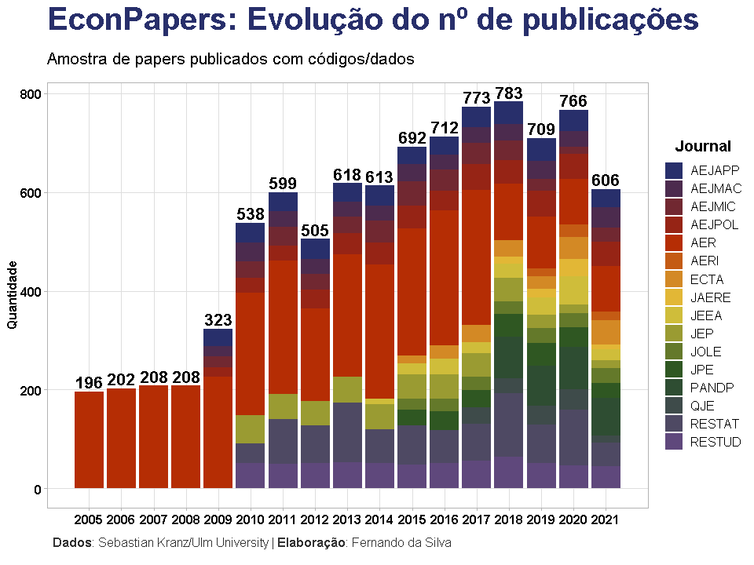
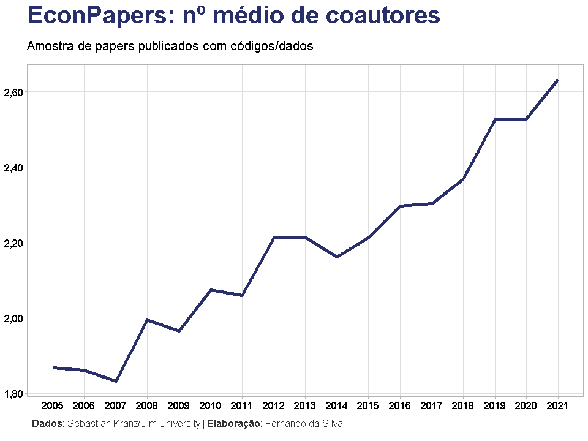
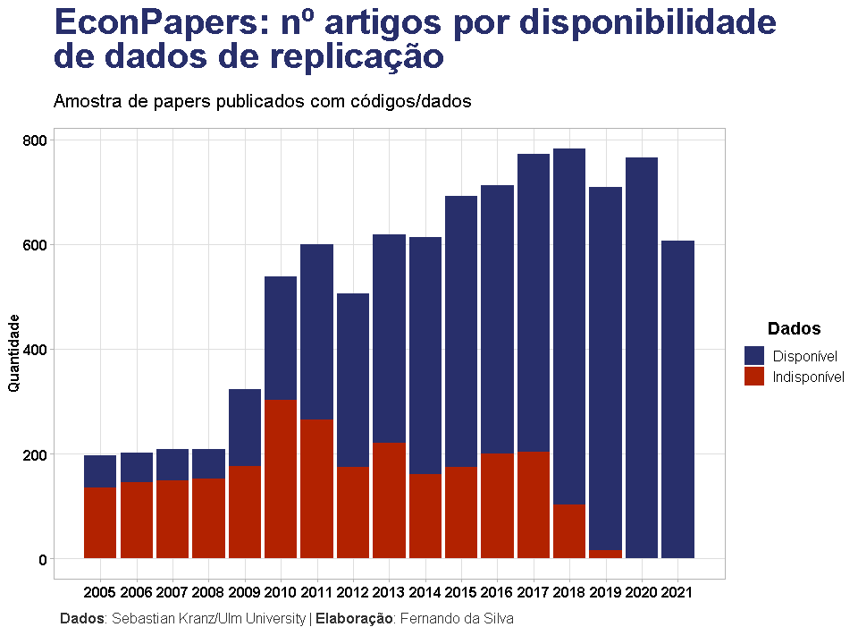
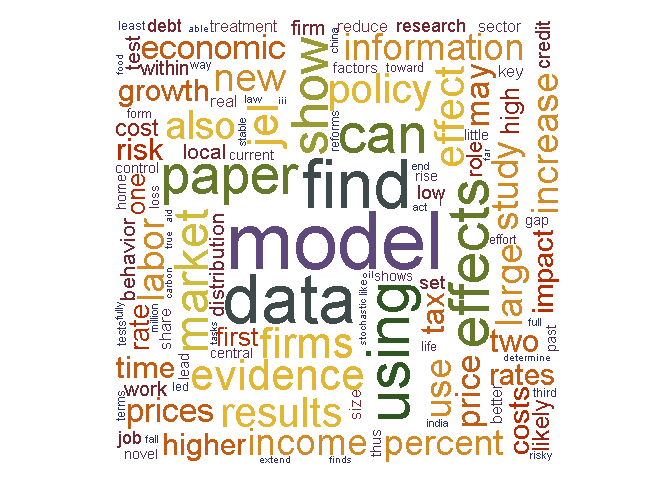

### Introdução

Quantos artigos na área de economia são publicados por ano? Quais são os
tópicos mais abordados? E as linguagens e softwares mais utilizados? R
vs. Python? Descubra as respostas destas perguntas neste texto que faz
uma análise exploratória de cerca de 9000 papers econômicos que
disponibilizam códigos/dados de 16 revistas/journals, no período de 2005
a 2021.

Principais descobertas sobre a amostra de dados:

-   Há forte tendência de crescimento no nº de publicações anual, porém
    com queda significativa desde 2019;
-   O número de coautores por paper quase dobrou desde 2005, chegando a
    2,63 em 2021;
-   A disponibilidade dos dados utilizados nos papers passou a ser 100%
    somente a partir de 2020;
-   Stata continua sendo o software mais utilizado, apesar da tendência
    de queda desde 2013, seguido por MATLAB, Python e R.

### Dados

Os dados são provenientes do trabalho incrível realizado por Sebastian
Kranz da Ulm University, encontre os detalhes e mais informações [neste
link](https://ejd.econ.mathematik.uni-ulm.de/). Em resumo, foi criado um
banco de dados de informações sobre papers que disponibilizam
códigos/dados. Essa informações incluem ano, título, número de autores,
abstract, URL, informações sobre arquivos disponíveis, etc.,
possibilitando uma pequena análise exploratória de dados. Vale frisar
que apesar de ser uma base de dados interessante, os dados representam
apenas uma amostra.

Os dados são proveniente de papers publicados nos journals da American
Economic Association (AEA), The Review of Economic Studies (REStud) e
The Review of Economics and Statistics (REST), além de uma parcela menor
(conforme política disponibilidade de dados) proveniente de QJE, JPE,
JEEA, Econometrica e JAERE.

Além disso, para quem se interessar, é possível utilizar uma [ferramenta
online](https://ejd.econ.mathematik.uni-ulm.de/) de pesquisa por
palavras chave, título, etc. para encontrar papers com código/dados
disponíveis.

Agora vamos ao código!

### Pacotes

Para reproduzir os códigos de R do exercício, certifique-se de que tenha
os seguintes pacotes instalados/carregados:

``` r
library(magrittr)  # CRAN v2.0.1
library(RSQLite)   # CRAN v2.2.1
library(dbmisc)    # github.com/skranz/dbmisc
library(dplyr)     # CRAN v1.0.7
library(ggplot2)   # CRAN v3.3.5
library(ggtext)    # CRAN v0.1.1
library(stringr)   # CRAN v1.4.0
library(scales)    # CRAN v1.1.1
library(tm)        # CRAN v0.7-8
library(wordcloud) # CRAN v2.6
```

### Importação de dados

Para importar os dados para o R, siga os seguintes comandos (não execute
caso não queira arquivos temporários baixados para seu computador):

``` r
# Link para baixar banco de dados
url_db <- "http://econ.mathematik.uni-ulm.de/ejd/articles.zip"

# Criar pasta temporária
temp_folder <- tempdir()

# Baixar arquivo (zipado)
download.file(
  url      = url_db,
  destfile = paste0(temp_folder, "\\", basename(url_db)),
  mode     = "wb" # talvez você precise mudar esse argumento, dependendo do seu sistema
  )

# Descompactar
unzip(
  zipfile = paste0(temp_folder, "\\", basename(url_db)), 
  exdir   = temp_folder
  )

# Listar arquivos na pasta
file_db <- list.files(temp_folder, pattern = "sqlite", full.names = TRUE)

# Copiar arquivos para diretório atual de trabalho
file.copy(from = file_db, to = getwd(), overwrite = TRUE)
```

    ## [1] TRUE

``` r
# Conexão com o banco de dados no R
db <- RSQLite::dbConnect(
  RSQLite::SQLite(), 
  list.files(getwd(), pattern = "sqlite")
  ) %>%
  dbmisc::set.db.schemas(
    schema.file = system.file(
      "schema/articles.yaml", 
      package = "EconJournalData"
      )
  )

class(db)
```

    ## [1] "SQLiteConnection"
    ## attr(,"package")
    ## [1] "RSQLite"

``` r
# Ler tabela com informações sobre os papers
df_articles <- dbmisc::dbGet(db, "article") %>% 
  dplyr::as_tibble()

df_articles
```

    ## # A tibble: 9,051 x 22
    ##    id             year  date journ title   vol issue artnum article_url has_data
    ##    <chr>         <int> <int> <chr> <chr> <int> <int>  <int> <chr>          <int>
    ##  1 aer_108_11_1   2018 17836 aer   Firm~   108    11      1 https://ww~        1
    ##  2 aer_108_11_2   2018 17836 aer   Near~   108    11      2 https://ww~        1
    ##  3 aer_108_11_3   2018 17836 aer   The ~   108    11      3 https://ww~        1
    ##  4 aer_108_11_4   2018 17836 aer   The ~   108    11      4 https://ww~        1
    ##  5 aer_108_11_5   2018 17836 aer   Stra~   108    11      5 https://ww~        1
    ##  6 aer_108_11_6   2018 17836 aer   Meas~   108    11      6 https://ww~        1
    ##  7 aer_108_11_7   2018 17836 aer   Mism~   108    11      7 https://ww~        1
    ##  8 aer_108_11_8   2018 17836 aer   Temp~   108    11      8 https://ww~        1
    ##  9 aer_108_11_9   2018 17836 aer   The ~   108    11      9 https://ww~        1
    ## 10 aer_108_11_10  2018 17836 aer   BKK ~   108    11     10 https://ww~        1
    ## # ... with 9,041 more rows, and 12 more variables: data_url <chr>, size <dbl>,
    ## #   unit <chr>, files_txt <chr>, downloaded_file <chr>, num_authors <int>,
    ## #   file_info_stored <int>, file_info_summarized <dbl>, abstract <chr>,
    ## #   readme_file <chr>, repo <chr>, repo_info <chr>

### Análise exploratória

A primeira pergunta que queremos responder se trata da quantidade de
papers na área da economia que são publicados por ano, nesta amostra de
dados. Geramos a visualização abaixo que mostra a evolução anual do nº
de papers por journal, assim como o total do ano. Caso tenha dúvidas
sobre as siglas, confira [este
link](https://ejd.econ.mathematik.uni-ulm.de/).

Seria a queda de publicações nos anos recentes um impacto da pandemia da
COVID-19?

``` r
# Cores para gráficos 
colors <- c(
  blue   = "#282f6b",
  red    = "#b22200",
  yellow = "#eace3f",
  green  = "#224f20",
  purple = "#5f487c"
  )
colors_aug <- grDevices::colorRampPalette(colors)(16)

# Texto de legenda
ft_caption <- "**Dados**: Sebastian Kranz/Ulm University | **Elaboração**: Fernando da Silva"

# Definir padrão de gráficos
theme_am <- function(){
  ggplot2::theme_light() %+replace%
  ggplot2::theme(
    axis.text        = ggtext::element_markdown(size = 12, face = "bold"),
    axis.title       = ggtext::element_markdown(size = 12, face = "bold"),
    panel.grid.minor = ggplot2::element_blank(),
    legend.title     = ggtext::element_markdown(size = 14, face = "bold"),
    legend.text      = ggtext::element_markdown(size = 12),
    plot.subtitle    = ggtext::element_markdown(size = 16, hjust = 0),
    plot.title       = ggtext::element_markdown(
      size   = 30,
      face   = "bold",
      colour = "#282f6b",
      hjust  = 0,
      ),
    plot.caption     = ggtext::element_textbox_simple(
      size   = 12,
      colour = "grey20",
      margin = ggplot2::margin(10, 5.5, 10, 5.5)
    )
  )
}
ggplot2::theme_set(theme_am())


# Evolução do número de artigos
df_articles %>% 
  dplyr::group_by(year, journ) %>% 
  dplyr::summarise(articles = dplyr::n(), .groups = "drop") %>% 
  dplyr::mutate(journ = stringr::str_to_upper(journ)) %>% 
  ggplot2::ggplot(ggplot2::aes(x = year, y = articles, fill = journ)) +
  ggplot2::geom_col() +
  ggplot2::stat_summary(
    ggplot2::aes(x = year, y = articles, label = ..y..), 
    fun         = sum, 
    geom        = "text",
    vjust       = -0.3,
    size        = 5.5,
    fontface    = "bold",
    inherit.aes = FALSE
    ) +
  ggplot2::scale_fill_manual(values = unname(colors_aug)) +
  ggplot2::scale_x_continuous(breaks = unique(df_articles$year)) +
  ggplot2::labs(
    title    = "EconPapers: Evolução do nº de publicações",
    subtitle = "<br>Amostra de papers publicados com códigos/dados<br>",
    y        = "Quantidade",
    x        = NULL,
    fill     = "Journal",
    caption  = ft_caption
  )
```



Também podemos obter a informação da evolução do número de coautores, em
média, nos papers.

Seria essa tendência de crescimento também observada em outras áreas?

``` r
# Número médio de autores
df_articles %>% 
  dplyr::group_by(year) %>% 
  dplyr::summarise(num_auth = mean(num_authors, na.rm = TRUE), .groups = "drop") %>% 
  ggplot2::ggplot(ggplot2::aes(x = year, y = num_auth)) +
  ggplot2::geom_line(size = 2, colour = unname(colors[1])) +
  ggplot2::scale_x_continuous(breaks = unique(df_articles$year)) +
  ggplot2::scale_y_continuous(labels = scales::comma_format(big.mark = "", decimal.mark = ",")) +
  ggplot2::labs(
    title    = "EconPapers: nº médio de coautores",
    subtitle = "<br>Amostra de papers publicados com códigos/dados<br>",
    y        = NULL,
    x        = NULL,
    caption  = ft_caption
  )
```



Dentro dessa amostra de dados, que traz somente informações de papers
que são publicados com disponibilização de códigos/dados de replicação,
podemos também obter a informação da quantidade de papers que têm dados
para download. Perceba que as barras em azul estão (felizmente)
predominando:

``` r
# Artigos com dados disponíveis
df_articles %>% 
  dplyr::group_by(year) %>% 
  dplyr::count(has_data) %>% 
  dplyr::ungroup() %>% 
  dplyr::mutate(
    has_data = dplyr::if_else(has_data == 0L, "Indisponível", "Disponível")
    ) %>% 
  ggplot2::ggplot(
    ggplot2::aes(
      x = year, 
      y = n, 
      fill = has_data
      )
    ) + 
  ggplot2::geom_col() +
  ggplot2::scale_fill_manual(values = unname(colors)) +
  ggplot2::scale_x_continuous(breaks = unique(df_articles$year)) +
  ggplot2::labs(
    title    = "EconPapers: nº artigos por disponibilidade<br>de dados de replicação",
    subtitle = "<br>Amostra de papers publicados com códigos/dados<br>",
    y        = "Quantidade",
    x        = NULL,
    fill     = "Dados",
    caption  = ft_caption
  )
```



Quais são os principais tópicos abordados nesses papers? Como só temos
acesso nessa base de dados ao abstract (o que costuma ser uma boa visão
geral do paper), podemos montar um núvem de palavras mais frequentes:

``` r
# Palavras mais frequentes nos Abstracts
abstract_txt <- df_articles$abstract[is.na(df_articles$abstract) == FALSE] %>% 
  tm::VectorSource() %>% 
  tm::Corpus()

abstract_txt_clean <- tm::tm_map(abstract_txt, tm::removePunctuation) %>% 
  tm::tm_map(tm::content_transformer(tolower)) %>% 
  tm::tm_map(tm::removeNumbers) %>% 
  tm::tm_map(tm::stripWhitespace) %>% 
  tm::tm_map(tm::removeWords, tm::stopwords("english")) %>% 
  tm::tm_map(tm::removeWords, "abstract")

wordcloud::wordcloud(
  words        = abstract_txt_clean,
  scale        = c(5, 0.5), 
  min.freq     = 70, 
  colors       = colors_aug,
  random.order = FALSE, 
  use.r.layout = FALSE,
  rot.per      = 0.35
  )
```



Por fim, mas não menos importante, se você é do time que gosta do velho
debate “R vs. Python”, prepare-se para quebrar a cara: na área econômica
o Stata e MATLAB (infelizmente) predominam, sendo utilizados na maior
parcela de papers públicados nesta amostra de dados.

A notícia boa é que parece haver uma tendência de queda do Stata, mesmo
que mais 50% dos papers atualmente ainda o utilizam.

Enquanto isso, R e Python estão em um lento crescimento, representando
uma parcela muito pequena de utilização nos papers. Suspeito que possam
ser ultrapassados pela linguagem Julia nos próximos anos.

``` r
# Ler tabela com informações sobre os arquivos dos papers
files_info <- dbmisc::dbGet(db,"files_summary") %>% 
  dplyr::as_tibble()


# Número de papers por tipo de arquivo
files_info %>%
  dplyr::left_join(dplyr::select(df_articles, year, id), by = "id") %>% 
  dplyr::filter(is_code == 1L) %>% 
  dplyr::count(year, file_type, name = "count") %>% 
  dplyr::group_by(year) %>% 
  dplyr::mutate(share = count / sum(count) * 100) %>% 
  dplyr::ungroup() %>% 
  dplyr::filter(file_type %in% c("do", "r", "py", "jl", "m")) %>% 
  ggplot2::ggplot(
    ggplot2::aes(
      x      = year, 
      y      = share,
      colour = file_type
      )
    ) + 
  ggplot2::geom_line(size = 1.5) +
  ggplot2::scale_colour_manual(values = unname(colors)) +
  ggplot2::scale_x_continuous(breaks = unique(df_articles$year)) +
  ggplot2::scale_y_continuous(breaks = scales::extended_breaks(n = 10)) +
  ggplot2::labs(
    title    = "EconPapers: utilização de linguagens",
    subtitle = "<br>Linguagens selecionadas, amostra de papers com código disponível, % do total no ano",
    y        = "%",
    x        = NULL,
    caption  = ft_caption
  ) +
  ggplot2::guides(
    colour = ggplot2::guide_legend(title = NULL, nrow = 1)
    ) +
  ggplot2::theme(legend.position = "top")
```


O que achou? Este texto é aberto para discussão/sugestões!


<script type="text/javascript" src="https://cdnjs.buymeacoffee.com/1.0.0/button.prod.min.js" data-name="bmc-button" data-slug="schoulten" data-color="#40DCA5" data-emoji=""  data-font="Cookie" data-text="Buy me a coffee" data-outline-color="#000000" data-font-color="#ffffff" data-coffee-color="#FFDD00" ></script>
