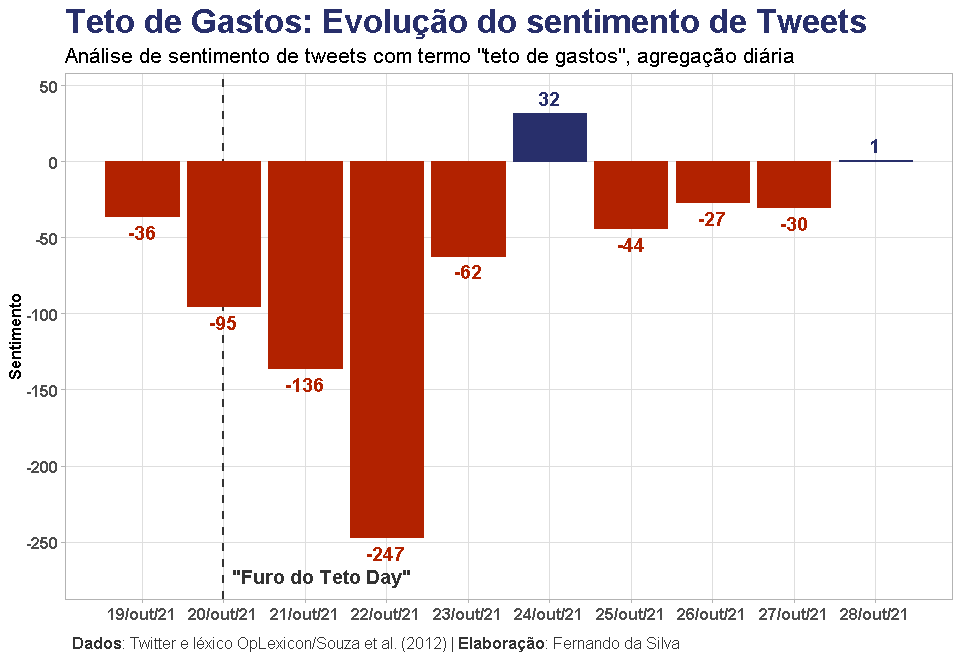

### Introdução

Não é qualquer dia, apesar da alta frequência do caso brasileiro, que
vivenciamos uma mudança de regime fiscal da economia. A falta de novos
erros e essa insistência nos velhos já traz consequências que começam a
ser absorvidas pelos agentes. A repercussão do furo do teto de gastos se
traduz em um claro e notório sentimento de desaprovação. Rodadas de
revisão de projeções naturalmente já tomam corpo no mercado. Dessa
forma, neste texto exercitamos uma forma de quantificar a repercussão do
evento através de uma simples análise de sentimentos, usando dados do
Twitter.

Sobre a técnica de análise de sentimentos e *text mining*, já explorei,
por exemplo, [uma aplicação com as atas do
COPOM](https://analisemacro.com.br/data-science/analise-das-atas-do-copom-com-text-mining/)
e outra com [detecção de plágio](https://fortietwo.com/posts/r/plagio/)
(códigos disponíveis em `R`). Para o exercício de hoje utilizaremos um
*framework* semelhante, mas com dados diferentes.

Vamos ao código!

### Pacotes

Para reproduzir os códigos de R deste exercício, certifique-se de que
tenha os seguintes pacotes instalados/carregados:

``` r
library(magrittr)  # CRAN v2.0.1
library(rtweet)    # CRAN v0.7.0
library(lexiconPT) # CRAN v0.1.0
library(dplyr)     # CRAN v1.0.7
library(tidytext)  # CRAN v0.2.6
library(purrr)     # CRAN v0.3.4
library(tidyr)     # CRAN v1.1.3
library(ggplot2)   # CRAN v3.3.5
library(ggtext)    # CRAN v0.1.1
library(scales)    # CRAN v1.1.1
```

### Dados

Conforme mencionado, os dados utilizados são provenientes do Twitter,
através de sua
[API](https://developer.twitter.com/en/docs/twitter-api/getting-started/about-twitter-api).
O objetivo é extrair *tweets* da rede social associados ao termo “teto
de gastos”, e então usar essas informações textuais no escopo da análise
de sentimentos através de um léxico da língua portuguesa.

O acesso aos dados do Twitter exige que o usuário seja cadastrado e
autenticado para interagir com a API. A interface em R para obter os
dados é feita através do pacote `rtweet`, que descreve em [sua
documentação](https://docs.ropensci.org/rtweet/#usage) as opções e
formas de realizar essa autenticação.

Já o léxico da língua portuguesa são provenientes de datasets do pacote
{`lexiconPT`}.

Com essas informações em mãos, você estará apto a reproduzir os códigos
do exercício. Caso tenha dificuldades, disponibilizamos [neste
link](https://analisemacro.com.br/download/34446/) em formato RDS o
dataset de tweets utilizado abaixo.

O código abaixo realiza a coleta dos dados, observando o que foi
mencionado acima:

``` r
# Importante: coleta de dados do Twitter exige autenticação de uso da API
# Veja como em: https://docs.ropensci.org/rtweet/#usage

# Coleta dados de tweets dos últimos 6-9 dias
df_tweets <- rtweet::search_tweets(
  q                = '"teto de gastos"', # pesquisar termo exato
  n                = 20000,              # número de tweets desejados
  include_rts      = FALSE,              # não incluir retweets
  retryonratelimit = TRUE                # para retornar o nº desejado de tweets
  )
```

``` r
dplyr::glimpse(df_tweets)
```

    ## Rows: 14,294
    ## Columns: 90
    ## $ user_id                 <chr> "142393421", "142393421", "142393421", "142393~
    ## $ status_id               <chr> "1453712895766720513", "1452461421422317571", ~
    ## $ created_at              <dttm> 2021-10-28 13:18:57, 2021-10-25 02:26:02, 202~
    ## $ screen_name             <chr> "GloboNews", "GloboNews", "GloboNews", "GloboN~
    ## $ text                    <chr> "Com a alta da inflação, os juros, que começar~
    ## $ source                  <chr> "Twitter Web App", "TweetDeck", "Twitter Web A~
    ## $ display_text_width      <dbl> 193, 272, 276, 160, 183, 249, 278, 279, 236, 2~
    ## $ reply_to_status_id      <chr> NA, "1452461155537068037", NA, "14524608641965~
    ## $ reply_to_user_id        <chr> NA, "142393421", NA, "142393421", "142393421",~
    ## $ reply_to_screen_name    <chr> NA, "GloboNews", NA, "GloboNews", "GloboNews",~
    ## $ is_quote                <lgl> FALSE, FALSE, FALSE, FALSE, FALSE, FALSE, FALS~
    ## $ is_retweet              <lgl> FALSE, FALSE, FALSE, FALSE, FALSE, FALSE, FALS~
    ## $ favorite_count          <int> 0, 27, 66, 17, 76, 27, 58, 73, 56, 51, 53, 91,~
    ## $ retweet_count           <int> 0, 7, 2, 1, 5, 3, 7, 7, 3, 3, 12, 8, 4, 3, 7, ~
    ## $ quote_count             <int> NA, NA, NA, NA, NA, NA, NA, NA, NA, NA, NA, NA~
    ## $ reply_count             <int> NA, NA, NA, NA, NA, NA, NA, NA, NA, NA, NA, NA~
    ## $ hashtags                <list> "GloboNews", "GloboNewsDebate", "GloboNews", ~
    ## $ symbols                 <list> NA, NA, NA, NA, NA, NA, NA, NA, NA, NA, NA, N~
    ## $ urls_url                <list> "glo.bo/3nwE00u", "glo.bo/3pzNhHU", "glo.bo/2~
    ## $ urls_t.co               <list> "https://t.co/3C0NbTIP4z", "https://t.co/NeiZ~
    ## $ urls_expanded_url       <list> "https://glo.bo/3nwE00u", "https://glo.bo/3pz~
    ## $ media_url               <list> NA, NA, NA, NA, NA, NA, NA, NA, NA, NA, NA, N~
    ## $ media_t.co              <list> NA, NA, NA, NA, NA, NA, NA, NA, NA, NA, NA, N~
    ## $ media_expanded_url      <list> NA, NA, NA, NA, NA, NA, NA, NA, NA, NA, NA, N~
    ## $ media_type              <list> NA, NA, NA, NA, NA, NA, NA, NA, NA, NA, NA, N~
    ## $ ext_media_url           <list> NA, NA, NA, NA, NA, NA, NA, NA, NA, NA, NA, N~
    ## $ ext_media_t.co          <list> NA, NA, NA, NA, NA, NA, NA, NA, NA, NA, NA, N~
    ## $ ext_media_expanded_url  <list> NA, NA, NA, NA, NA, NA, NA, NA, NA, NA, NA, N~
    ## $ ext_media_type          <chr> NA, NA, NA, NA, NA, NA, NA, NA, NA, NA, NA, NA~
    ## $ mentions_user_id        <list> "16814640", <"31483090", "43554342">, NA, <"3~
    ## $ mentions_screen_name    <list> "miriamleitao", <"juliaduailibi", "ValdoCruz"~
    ## $ lang                    <chr> "pt", "pt", "pt", "pt", "pt", "pt", "pt", "pt"~
    ## $ quoted_status_id        <chr> NA, NA, NA, NA, NA, NA, NA, NA, NA, NA, NA, NA~
    ## $ quoted_text             <chr> NA, NA, NA, NA, NA, NA, NA, NA, NA, NA, NA, NA~
    ## $ quoted_created_at       <dttm> NA, NA, NA, NA, NA, NA, NA, NA, NA, NA, NA, N~
    ## $ quoted_source           <chr> NA, NA, NA, NA, NA, NA, NA, NA, NA, NA, NA, NA~
    ## $ quoted_favorite_count   <int> NA, NA, NA, NA, NA, NA, NA, NA, NA, NA, NA, NA~
    ## $ quoted_retweet_count    <int> NA, NA, NA, NA, NA, NA, NA, NA, NA, NA, NA, NA~
    ## $ quoted_user_id          <chr> NA, NA, NA, NA, NA, NA, NA, NA, NA, NA, NA, NA~
    ## $ quoted_screen_name      <chr> NA, NA, NA, NA, NA, NA, NA, NA, NA, NA, NA, NA~
    ## $ quoted_name             <chr> NA, NA, NA, NA, NA, NA, NA, NA, NA, NA, NA, NA~
    ## $ quoted_followers_count  <int> NA, NA, NA, NA, NA, NA, NA, NA, NA, NA, NA, NA~
    ## $ quoted_friends_count    <int> NA, NA, NA, NA, NA, NA, NA, NA, NA, NA, NA, NA~
    ## $ quoted_statuses_count   <int> NA, NA, NA, NA, NA, NA, NA, NA, NA, NA, NA, NA~
    ## $ quoted_location         <chr> NA, NA, NA, NA, NA, NA, NA, NA, NA, NA, NA, NA~
    ## $ quoted_description      <chr> NA, NA, NA, NA, NA, NA, NA, NA, NA, NA, NA, NA~
    ## $ quoted_verified         <lgl> NA, NA, NA, NA, NA, NA, NA, NA, NA, NA, NA, NA~
    ## $ retweet_status_id       <chr> NA, NA, NA, NA, NA, NA, NA, NA, NA, NA, NA, NA~
    ## $ retweet_text            <chr> NA, NA, NA, NA, NA, NA, NA, NA, NA, NA, NA, NA~
    ## $ retweet_created_at      <dttm> NA, NA, NA, NA, NA, NA, NA, NA, NA, NA, NA, N~
    ## $ retweet_source          <chr> NA, NA, NA, NA, NA, NA, NA, NA, NA, NA, NA, NA~
    ## $ retweet_favorite_count  <int> NA, NA, NA, NA, NA, NA, NA, NA, NA, NA, NA, NA~
    ## $ retweet_retweet_count   <int> NA, NA, NA, NA, NA, NA, NA, NA, NA, NA, NA, NA~
    ## $ retweet_user_id         <chr> NA, NA, NA, NA, NA, NA, NA, NA, NA, NA, NA, NA~
    ## $ retweet_screen_name     <chr> NA, NA, NA, NA, NA, NA, NA, NA, NA, NA, NA, NA~
    ## $ retweet_name            <chr> NA, NA, NA, NA, NA, NA, NA, NA, NA, NA, NA, NA~
    ## $ retweet_followers_count <int> NA, NA, NA, NA, NA, NA, NA, NA, NA, NA, NA, NA~
    ## $ retweet_friends_count   <int> NA, NA, NA, NA, NA, NA, NA, NA, NA, NA, NA, NA~
    ## $ retweet_statuses_count  <int> NA, NA, NA, NA, NA, NA, NA, NA, NA, NA, NA, NA~
    ## $ retweet_location        <chr> NA, NA, NA, NA, NA, NA, NA, NA, NA, NA, NA, NA~
    ## $ retweet_description     <chr> NA, NA, NA, NA, NA, NA, NA, NA, NA, NA, NA, NA~
    ## $ retweet_verified        <lgl> NA, NA, NA, NA, NA, NA, NA, NA, NA, NA, NA, NA~
    ## $ place_url               <chr> NA, NA, NA, NA, NA, NA, NA, NA, NA, NA, NA, NA~
    ## $ place_name              <chr> NA, NA, NA, NA, NA, NA, NA, NA, NA, NA, NA, NA~
    ## $ place_full_name         <chr> NA, NA, NA, NA, NA, NA, NA, NA, NA, NA, NA, NA~
    ## $ place_type              <chr> NA, NA, NA, NA, NA, NA, NA, NA, NA, NA, NA, NA~
    ## $ country                 <chr> NA, NA, NA, NA, NA, NA, NA, NA, NA, NA, NA, NA~
    ## $ country_code            <chr> NA, NA, NA, NA, NA, NA, NA, NA, NA, NA, NA, NA~
    ## $ geo_coords              <list> <NA, NA>, <NA, NA>, <NA, NA>, <NA, NA>, <NA, ~
    ## $ coords_coords           <list> <NA, NA>, <NA, NA>, <NA, NA>, <NA, NA>, <NA, ~
    ## $ bbox_coords             <list> <NA, NA, NA, NA, NA, NA, NA, NA>, <NA, NA, NA~
    ## $ status_url              <chr> "https://twitter.com/GloboNews/status/14537128~
    ## $ name                    <chr> "GloboNews", "GloboNews", "GloboNews", "GloboN~
    ## $ location                <chr> "Brasil", "Brasil", "Brasil", "Brasil", "Brasi~
    ## $ description             <chr> "Nunca desliga", "Nunca desliga", "Nunca desli~
    ## $ url                     <chr> "http://t.co/Gz0Fha2UwH", "http://t.co/Gz0Fha2~
    ## $ protected               <lgl> FALSE, FALSE, FALSE, FALSE, FALSE, FALSE, FALS~
    ## $ followers_count         <int> 4822368, 4822368, 4822368, 4822368, 4822368, 4~
    ## $ friends_count           <int> 122, 122, 122, 122, 122, 122, 122, 122, 122, 1~
    ## $ listed_count            <int> 7345, 7345, 7345, 7345, 7345, 7345, 7345, 7345~
    ## $ statuses_count          <int> 139414, 139414, 139414, 139414, 139414, 139414~
    ## $ favourites_count        <int> 136, 136, 136, 136, 136, 136, 136, 136, 136, 1~
    ## $ account_created_at      <dttm> 2010-05-10 19:31:38, 2010-05-10 19:31:38, 201~
    ## $ verified                <lgl> TRUE, TRUE, TRUE, TRUE, TRUE, TRUE, TRUE, TRUE~
    ## $ profile_url             <chr> "http://t.co/Gz0Fha2UwH", "http://t.co/Gz0Fha2~
    ## $ profile_expanded_url    <chr> "http://g1.com.br/globonews", "http://g1.com.b~
    ## $ account_lang            <lgl> NA, NA, NA, NA, NA, NA, NA, NA, NA, NA, NA, NA~
    ## $ profile_banner_url      <chr> "https://pbs.twimg.com/profile_banners/1423934~
    ## $ profile_background_url  <chr> "http://abs.twimg.com/images/themes/theme1/bg.~
    ## $ profile_image_url       <chr> "http://pbs.twimg.com/profile_images/123462925~

``` r
# Léxicos da língua portuguesa para análise de sentimentos
oplex <- lexiconPT::oplexicon_v3.0
sentilex <- lexiconPT::sentiLex_lem_PT02

dplyr::glimpse(oplex)
```

    ## Rows: 32,191
    ## Columns: 4
    ## $ term              <chr> "=[", "=@", "=p", "=P", "=x", "=d", "=D", ";)", ";)"~
    ## $ type              <chr> "emot", "emot", "emot", "emot", "emot", "emot", "emo~
    ## $ polarity          <int> -1, -1, -1, -1, -1, 1, 1, 1, 1, -1, -1, -1, -1, -1, ~
    ## $ polarity_revision <chr> "A", "A", "A", "A", "A", "A", "A", "A", "A", "A", "A~

``` r
dplyr::glimpse(sentilex)
```

    ## Rows: 7,014
    ## Columns: 5
    ## $ term                    <chr> "a-vontade", "abafado", "abafante", "abaixado"~
    ## $ grammar_category        <chr> "N", "Adj", "Adj", "Adj", "Adj", "Adj", "Adj",~
    ## $ polarity                <dbl> 1, -1, -1, -1, -1, 1, -1, 1, 1, -1, -1, -1, -1~
    ## $ polarity_target         <chr> "N0", "N0", "N0", "N0", "N0", "N0", "N0", "N0:~
    ## $ polarity_classification <chr> "MAN", "JALC", "MAN", "JALC", "JALC", "JALC", ~

Observe que o dataset dos tweets traz diversas informações, contendo um
identificador único de cada tweet (status\_id), data e horário
(created\_at), mensagem de texto (text), dentre outras. E as opções de
léxicos do pacote trazem uma coluna com o termo/palavra e outras
informações, sendo a polaridade a principal delas pois indica se o termo
está associado a um sentimento “negativo” ou “positivo”, e é o que
utilizaremos para fazer a análise de sentimentos.

Com esses conjuntos de informação já temos tudo que precisamos para
iniciar uma simples análise de sentimentos.

### Tokenização

O primeiro passo a ser feito é desagregar a informação das mensagens de
texto de cada tweet de modo a separar essas mensagens em várias
palavras/tokens. Esse processo é conhecido como “tokenização” e sua
implementação é bastante simples, conforme abaixo:

``` r
# Separa coluna "text", que são os tweets, em n tokens/palavras
df_token <- df_tweets %>%
  tidytext::unnest_tokens(output = "term", input = "text")

# Resultado é a coluna "term" com um token/palavra por linha do data frame
dplyr::glimpse(df_token)
```

    ## Rows: 437,619
    ## Columns: 90
    ## $ user_id                 <chr> "142393421", "142393421", "142393421", "142393~
    ## $ status_id               <chr> "1453712895766720513", "1453712895766720513", ~
    ## $ created_at              <dttm> 2021-10-28 13:18:57, 2021-10-28 13:18:57, 202~
    ## $ screen_name             <chr> "GloboNews", "GloboNews", "GloboNews", "GloboN~
    ## $ source                  <chr> "Twitter Web App", "Twitter Web App", "Twitter~
    ## $ display_text_width      <dbl> 193, 193, 193, 193, 193, 193, 193, 193, 193, 1~
    ## $ reply_to_status_id      <chr> NA, NA, NA, NA, NA, NA, NA, NA, NA, NA, NA, NA~
    ## $ reply_to_user_id        <chr> NA, NA, NA, NA, NA, NA, NA, NA, NA, NA, NA, NA~
    ## $ reply_to_screen_name    <chr> NA, NA, NA, NA, NA, NA, NA, NA, NA, NA, NA, NA~
    ## $ is_quote                <lgl> FALSE, FALSE, FALSE, FALSE, FALSE, FALSE, FALS~
    ## $ is_retweet              <lgl> FALSE, FALSE, FALSE, FALSE, FALSE, FALSE, FALS~
    ## $ favorite_count          <int> 0, 0, 0, 0, 0, 0, 0, 0, 0, 0, 0, 0, 0, 0, 0, 0~
    ## $ retweet_count           <int> 0, 0, 0, 0, 0, 0, 0, 0, 0, 0, 0, 0, 0, 0, 0, 0~
    ## $ quote_count             <int> NA, NA, NA, NA, NA, NA, NA, NA, NA, NA, NA, NA~
    ## $ reply_count             <int> NA, NA, NA, NA, NA, NA, NA, NA, NA, NA, NA, NA~
    ## $ hashtags                <list> "GloboNews", "GloboNews", "GloboNews", "Globo~
    ## $ symbols                 <list> NA, NA, NA, NA, NA, NA, NA, NA, NA, NA, NA, N~
    ## $ urls_url                <list> "glo.bo/3nwE00u", "glo.bo/3nwE00u", "glo.bo/3~
    ## $ urls_t.co               <list> "https://t.co/3C0NbTIP4z", "https://t.co/3C0N~
    ## $ urls_expanded_url       <list> "https://glo.bo/3nwE00u", "https://glo.bo/3nw~
    ## $ media_url               <list> NA, NA, NA, NA, NA, NA, NA, NA, NA, NA, NA, N~
    ## $ media_t.co              <list> NA, NA, NA, NA, NA, NA, NA, NA, NA, NA, NA, N~
    ## $ media_expanded_url      <list> NA, NA, NA, NA, NA, NA, NA, NA, NA, NA, NA, N~
    ## $ media_type              <list> NA, NA, NA, NA, NA, NA, NA, NA, NA, NA, NA, N~
    ## $ ext_media_url           <list> NA, NA, NA, NA, NA, NA, NA, NA, NA, NA, NA, N~
    ## $ ext_media_t.co          <list> NA, NA, NA, NA, NA, NA, NA, NA, NA, NA, NA, N~
    ## $ ext_media_expanded_url  <list> NA, NA, NA, NA, NA, NA, NA, NA, NA, NA, NA, N~
    ## $ ext_media_type          <chr> NA, NA, NA, NA, NA, NA, NA, NA, NA, NA, NA, NA~
    ## $ mentions_user_id        <list> "16814640", "16814640", "16814640", "16814640~
    ## $ mentions_screen_name    <list> "miriamleitao", "miriamleitao", "miriamleitao~
    ## $ lang                    <chr> "pt", "pt", "pt", "pt", "pt", "pt", "pt", "pt"~
    ## $ quoted_status_id        <chr> NA, NA, NA, NA, NA, NA, NA, NA, NA, NA, NA, NA~
    ## $ quoted_text             <chr> NA, NA, NA, NA, NA, NA, NA, NA, NA, NA, NA, NA~
    ## $ quoted_created_at       <dttm> NA, NA, NA, NA, NA, NA, NA, NA, NA, NA, NA, N~
    ## $ quoted_source           <chr> NA, NA, NA, NA, NA, NA, NA, NA, NA, NA, NA, NA~
    ## $ quoted_favorite_count   <int> NA, NA, NA, NA, NA, NA, NA, NA, NA, NA, NA, NA~
    ## $ quoted_retweet_count    <int> NA, NA, NA, NA, NA, NA, NA, NA, NA, NA, NA, NA~
    ## $ quoted_user_id          <chr> NA, NA, NA, NA, NA, NA, NA, NA, NA, NA, NA, NA~
    ## $ quoted_screen_name      <chr> NA, NA, NA, NA, NA, NA, NA, NA, NA, NA, NA, NA~
    ## $ quoted_name             <chr> NA, NA, NA, NA, NA, NA, NA, NA, NA, NA, NA, NA~
    ## $ quoted_followers_count  <int> NA, NA, NA, NA, NA, NA, NA, NA, NA, NA, NA, NA~
    ## $ quoted_friends_count    <int> NA, NA, NA, NA, NA, NA, NA, NA, NA, NA, NA, NA~
    ## $ quoted_statuses_count   <int> NA, NA, NA, NA, NA, NA, NA, NA, NA, NA, NA, NA~
    ## $ quoted_location         <chr> NA, NA, NA, NA, NA, NA, NA, NA, NA, NA, NA, NA~
    ## $ quoted_description      <chr> NA, NA, NA, NA, NA, NA, NA, NA, NA, NA, NA, NA~
    ## $ quoted_verified         <lgl> NA, NA, NA, NA, NA, NA, NA, NA, NA, NA, NA, NA~
    ## $ retweet_status_id       <chr> NA, NA, NA, NA, NA, NA, NA, NA, NA, NA, NA, NA~
    ## $ retweet_text            <chr> NA, NA, NA, NA, NA, NA, NA, NA, NA, NA, NA, NA~
    ## $ retweet_created_at      <dttm> NA, NA, NA, NA, NA, NA, NA, NA, NA, NA, NA, N~
    ## $ retweet_source          <chr> NA, NA, NA, NA, NA, NA, NA, NA, NA, NA, NA, NA~
    ## $ retweet_favorite_count  <int> NA, NA, NA, NA, NA, NA, NA, NA, NA, NA, NA, NA~
    ## $ retweet_retweet_count   <int> NA, NA, NA, NA, NA, NA, NA, NA, NA, NA, NA, NA~
    ## $ retweet_user_id         <chr> NA, NA, NA, NA, NA, NA, NA, NA, NA, NA, NA, NA~
    ## $ retweet_screen_name     <chr> NA, NA, NA, NA, NA, NA, NA, NA, NA, NA, NA, NA~
    ## $ retweet_name            <chr> NA, NA, NA, NA, NA, NA, NA, NA, NA, NA, NA, NA~
    ## $ retweet_followers_count <int> NA, NA, NA, NA, NA, NA, NA, NA, NA, NA, NA, NA~
    ## $ retweet_friends_count   <int> NA, NA, NA, NA, NA, NA, NA, NA, NA, NA, NA, NA~
    ## $ retweet_statuses_count  <int> NA, NA, NA, NA, NA, NA, NA, NA, NA, NA, NA, NA~
    ## $ retweet_location        <chr> NA, NA, NA, NA, NA, NA, NA, NA, NA, NA, NA, NA~
    ## $ retweet_description     <chr> NA, NA, NA, NA, NA, NA, NA, NA, NA, NA, NA, NA~
    ## $ retweet_verified        <lgl> NA, NA, NA, NA, NA, NA, NA, NA, NA, NA, NA, NA~
    ## $ place_url               <chr> NA, NA, NA, NA, NA, NA, NA, NA, NA, NA, NA, NA~
    ## $ place_name              <chr> NA, NA, NA, NA, NA, NA, NA, NA, NA, NA, NA, NA~
    ## $ place_full_name         <chr> NA, NA, NA, NA, NA, NA, NA, NA, NA, NA, NA, NA~
    ## $ place_type              <chr> NA, NA, NA, NA, NA, NA, NA, NA, NA, NA, NA, NA~
    ## $ country                 <chr> NA, NA, NA, NA, NA, NA, NA, NA, NA, NA, NA, NA~
    ## $ country_code            <chr> NA, NA, NA, NA, NA, NA, NA, NA, NA, NA, NA, NA~
    ## $ geo_coords              <list> <NA, NA>, <NA, NA>, <NA, NA>, <NA, NA>, <NA, ~
    ## $ coords_coords           <list> <NA, NA>, <NA, NA>, <NA, NA>, <NA, NA>, <NA, ~
    ## $ bbox_coords             <list> <NA, NA, NA, NA, NA, NA, NA, NA>, <NA, NA, NA~
    ## $ status_url              <chr> "https://twitter.com/GloboNews/status/14537128~
    ## $ name                    <chr> "GloboNews", "GloboNews", "GloboNews", "GloboN~
    ## $ location                <chr> "Brasil", "Brasil", "Brasil", "Brasil", "Brasi~
    ## $ description             <chr> "Nunca desliga", "Nunca desliga", "Nunca desli~
    ## $ url                     <chr> "http://t.co/Gz0Fha2UwH", "http://t.co/Gz0Fha2~
    ## $ protected               <lgl> FALSE, FALSE, FALSE, FALSE, FALSE, FALSE, FALS~
    ## $ followers_count         <int> 4822368, 4822368, 4822368, 4822368, 4822368, 4~
    ## $ friends_count           <int> 122, 122, 122, 122, 122, 122, 122, 122, 122, 1~
    ## $ listed_count            <int> 7345, 7345, 7345, 7345, 7345, 7345, 7345, 7345~
    ## $ statuses_count          <int> 139414, 139414, 139414, 139414, 139414, 139414~
    ## $ favourites_count        <int> 136, 136, 136, 136, 136, 136, 136, 136, 136, 1~
    ## $ account_created_at      <dttm> 2010-05-10 19:31:38, 2010-05-10 19:31:38, 201~
    ## $ verified                <lgl> TRUE, TRUE, TRUE, TRUE, TRUE, TRUE, TRUE, TRUE~
    ## $ profile_url             <chr> "http://t.co/Gz0Fha2UwH", "http://t.co/Gz0Fha2~
    ## $ profile_expanded_url    <chr> "http://g1.com.br/globonews", "http://g1.com.b~
    ## $ account_lang            <lgl> NA, NA, NA, NA, NA, NA, NA, NA, NA, NA, NA, NA~
    ## $ profile_banner_url      <chr> "https://pbs.twimg.com/profile_banners/1423934~
    ## $ profile_background_url  <chr> "http://abs.twimg.com/images/themes/theme1/bg.~
    ## $ profile_image_url       <chr> "http://pbs.twimg.com/profile_images/123462925~
    ## $ term                    <chr> "com", "a", "alta", "da", "inflação", "os", "j~

Observe que o número de linhas aumentou consideravelmente, dada a
separação dos tweets em *n* tokens.

### Análise de sentimentos

Com esse volume de informações sobre a amostra de tweets coletada,
podemos usar a classificação da polaridade (sentimento) de um dos
léxicos acima para verificar por tweet quais palavras expressam sentimos
mais positivos ou mais negativos:

``` r
# 1) Juntar tokens com léxicos e obter polaridade por tweet

# Juntar dados
df_sent <- purrr::reduce(
  .x = list(
    df_token,
    oplex,
    dplyr::select(sentilex, term, lex_polarity = polarity)
    ),
  .f = dplyr::inner_join,
  by = "term"
  ) %>%
  # Agrupar por identificador único de cada tweet
  dplyr::group_by(status_id) %>%
  # Obter sentimento total de cada tweet de acordo com polaridade
  # para saber quão negativo/positivo é um tweet
  dplyr::summarise(
    tweet_oplex    = sum(polarity),
    tweet_sentilex = sum(lex_polarity)
    ) %>%
  dplyr::ungroup()

dplyr::glimpse(df_sent)
```

    ## Rows: 5,676
    ## Columns: 3
    ## $ status_id      <chr> "1450503643401162754", "1450503652632891395", "14505040~
    ## $ tweet_oplex    <int> 2, 2, -1, -2, -1, 1, 1, 0, 0, 1, -1, 0, 0, -1, -1, 1, 2~
    ## $ tweet_sentilex <dbl> 2, 2, -1, -2, 1, 0, -1, 0, 0, 1, 0, -1, 1, 0, -1, 0, 1,~

O resultado é um novo dataset com a identificação de cada tweet e o
correspondente sentimento (soma da polaridade) obtido através dos tokens
extraídos acima. Perceba que perdemos observações pois algumas palavras
não estão presentes nos léxicos utilizados.

O próximo passo é um tratamento adicional dos dados de modo a obter o
sentimento diário desse conjunto amostral de tweets:

``` r
# 2) Usar polaridade por tweet para obter sentimento diário

# Juntar dados de tweets e polaridades
df_sent_by_date <- dplyr::inner_join(df_tweets, df_sent, by = "status_id") %>%
  # Filtrar somente polaridades positivas/negativas
  dplyr::filter(tweet_oplex != 0) %>%
  # Obter quantidade de tweets com sentimento "negativo/positivo" por dia
  dplyr::count(
    sentiment = dplyr::if_else(tweet_oplex < 0, "negativo", "positivo"),
    date      = as.Date(created_at)
  ) %>%
  # Converter para formato wide
  tidyr::pivot_wider(
    id_cols     = `date`,
    names_from  = `sentiment`,
    values_from = `n`
    ) %>%
  # Obter sentimento diário
  dplyr::mutate(sentimento = positivo - negativo)

dplyr::glimpse(df_sent_by_date)
```

    ## Rows: 10
    ## Columns: 4
    ## $ date       <date> 2021-10-19, 2021-10-20, 2021-10-21, 2021-10-22, 2021-10-23~
    ## $ negativo   <int> 118, 249, 558, 734, 265, 137, 171, 110, 91, 27
    ## $ positivo   <int> 82, 154, 422, 487, 203, 169, 127, 83, 61, 28
    ## $ sentimento <int> -36, -95, -136, -247, -62, 32, -44, -27, -30, 1

O resultado é um dataset que contabiliza por dia o sentimento expresso
nos tweets detectado através da polaridade.

### Visualização de resultados

Por fim podemos gerar um gráfico bacana para observar a evolução do
sentimento ao longo do tempo. É bastante notório o sentimento negativo
após as declarações do Ministro da Economia, Paulo Guedes, em 20 de
outubro de 2021:

``` r
# Gerar gráfico de colunas
df_sent_by_date %>%
  dplyr::mutate(fill = dplyr::if_else(sentimento < 0, "#b22200", "#282f6b")) %>%
  ggplot2::ggplot(ggplot2::aes(x = date, y = sentimento, fill = fill, color = fill)) +
  ggplot2::geom_vline(
    xintercept = as.Date("2021-10-20"),
    linetype   = "dashed",
    size       = 1,
    color      = "grey20"
    ) +
  ggplot2::geom_col() +
  ggplot2::geom_text(
    ggplot2::aes(
      x     = as.Date("2021-10-20"),
      y     = min(df_sent_by_date$sentimento)-25,
      label = '"Furo do Teto Day"'
      ),
    hjust    = -0.05,
    color    = "grey20",
    size     = 5,
    fontface ="bold"
    ) +
  ggplot2::geom_text(
    ggplot2::aes(y = sentimento + 10 * sign(sentimento), label = sentimento),
    position = ggplot2::position_dodge(width = 0.5),
    fontface = "bold",
    size     = 5
    ) +
  ggplot2::scale_y_continuous(
    limits = c(min(df_sent_by_date$sentimento)-25, max(df_sent_by_date$sentimento)+10),
    breaks = scales::extended_breaks(10)
    ) +
  ggplot2::scale_x_date(date_breaks = "1 day", labels = scales::date_format("%d/%b/%y")) +
  ggplot2::scale_fill_identity() +
  ggplot2::scale_color_identity() +
  ggplot2::labs(
    title    = "Teto de Gastos: Evolução do sentimento de Tweets",
    subtitle = 'Análise de sentimento de tweets com termo "teto de gastos", agregação diária',
    x        = NULL,
    y        = "Sentimento",
    caption  = "**Dados**: Twitter e léxico OpLexicon/Souza et al. (2012) | **Elaboração**: Fernando da Silva"
    ) +
  ggplot2::theme_light() +
  ggplot2::theme(
    axis.text        = ggtext::element_markdown(size = 12, face = "bold"),
    axis.title       = ggtext::element_markdown(size = 12, face = "bold"),
    panel.grid.minor = ggplot2::element_blank(),
    plot.title       = ggtext::element_markdown(size = 25, face = "bold", colour = "#282f6b"),
    plot.subtitle    = ggtext::element_markdown(size = 16),
    plot.caption     = ggtext::element_textbox_simple(
      size   = 12,
      colour = "grey20",
      margin = ggplot2::margin(10, 5.5, 10, 5.5)
    )
  )
```



Interessante, não? A técnica de análise de sentimentos é bastante
promissora, e este simples exercício já demonstra sua facilidade de
aplicação.

Um ponto importante que foi ignorado é a possibilidade de haver, no
conjunto amostral de tweets coletados através API, uma quantidade
significativa de contas “bot” do Twitter. Quando o assunto é política,
governo, etc. isso é particularmente expressivo e problemático (seja no
sentido de apoio ou oposição ao governo), de modo que pode distorcer a
análise acima. Pretendo abordar esse assunto em um post futuro!

### Referências

Recomenda-se consultar a documentação dos pacotes utilizados para
entendimento aprofundado sobre as funcionalidades.

-   Documentação do `rtweet`:
    <https://docs.ropensci.org/rtweet/index.html>
-   Documentação `lexiconPT`:
    <https://cran.r-project.org/web/packages/lexiconPT/>
-   Documentação `tidytext`:
    <https://cran.r-project.org/web/packages/tidytext/>
-   Exemplo de uso do `lexiconPT` com dados do Facebook:
    <https://sillasgonzaga.github.io/2017-09-23-sensacionalista-pt01/>


<script type="text/javascript" src="https://cdnjs.buymeacoffee.com/1.0.0/button.prod.min.js" data-name="bmc-button" data-slug="schoulten" data-color="#40DCA5" data-emoji=""  data-font="Cookie" data-text="Buy me a coffee" data-outline-color="#000000" data-font-color="#ffffff" data-coffee-color="#FFDD00" ></script>
