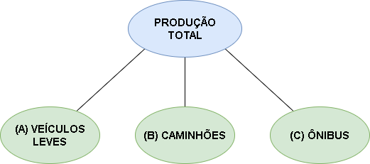
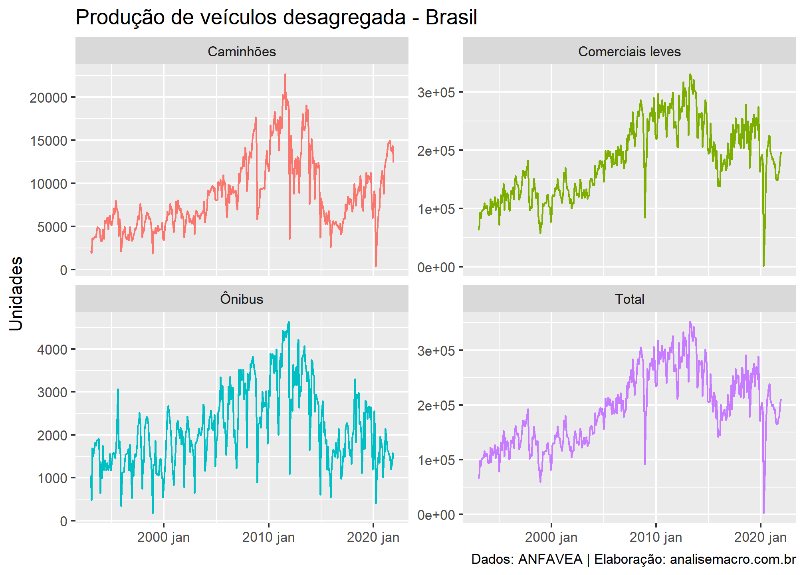
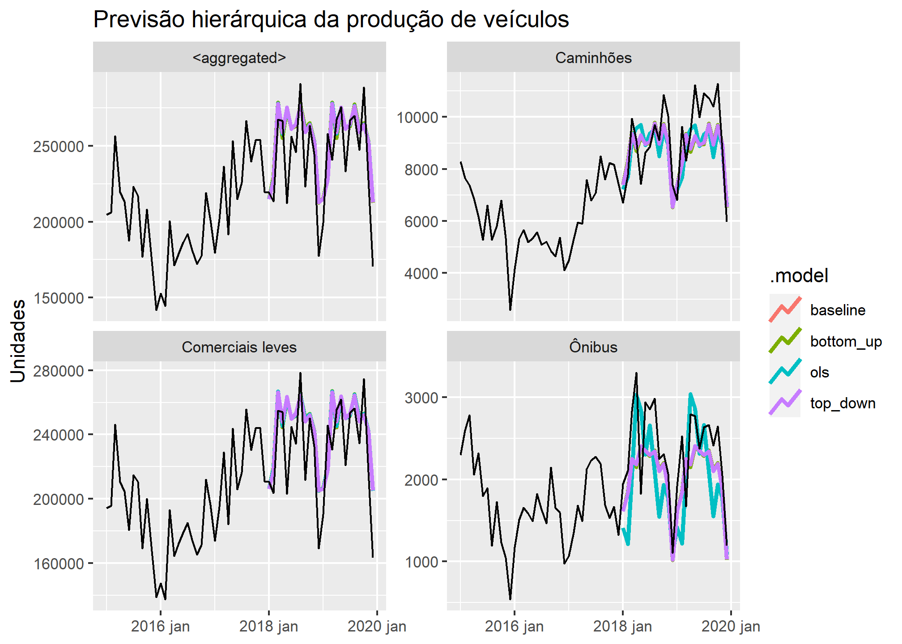

Gerando previsões desagregadas de séries temporais no R
================
Fernando da Silva, Cientista de Dados
06 de fevereiro de 2022

### Introdução

Frequentemente, **séries temporais podem ser desagregadas** em vários
atributos de interesse. Por exemplo<sup>1</sup>, o número total de
veículos produzidos no país ao longo do tempo pode ser dividido em
veículos comerciais leves, caminhões, ônibus, etc. Cada uma dessas
categorias pode ainda ser desagregada em outros níveis, por regiões, por
fabricante, etc., caracterizando o que pode ser chamado de “séries
temporais hierárquicas”.



<br>

Essa riqueza de informação e dados possibilita (e pode ser de interesse)
**gerar previsões desagregadas das séries**, de modo que os pontos de
previsão das séries desagregadas possam ser analisados individualmente e
que, quando agregados de alguma forma, sejam coerentes com os valores
agregados da série.

De modo geral, podemos representar o exemplo como:

*y*<sub>*t*</sub> = *y*<sub>*A*, *t*</sub> + *y*<sub>*B*, *t*</sub> + *y*<sub>*C*, *t*</sub>

Ou seja, para qualquer observação no tempo *t*, as observações no nível
inferior da hierarquia serão agregadas para formar as observações da
série acima.

### Previsão hierárquica

Existem várias **abordagens** para gerar previsões hierárquicas com
séries temporais, a mais comum e intuitiva é a ***bottom-up*** (de baixo
para cima), onde primeiro geramos as previsões para cada série no nível
inferior e, em seguida, somamos os pontos de previsão para obter
previsões da série acima.

Por outro lado, a abordagem ***top-down*** (de cima para baixo) envolve
primeiro a geração de previsões para a série agregada e, em seguida,
desagregá-la na hierarquia utilizando proporções (geralmente baseadas na
série histórica).

Ainda existem outras abordagens como a do ***Minimum Trace*** e suas
variantes, sendo que cada uma tem seus prós e contras. Para se
aprofundar no tema veja *Forecasting: principles and practice* de
Hyndman, R.J., & Athanasopoulos, G. (2021), que apresenta detalhes sobre
as abordagens disponíveis.

### Exemplo: dados de produção da ANFAVEA

Mensalmente a ANFAVEA disponibiliza séries temporais da produção,
licenciamento, exportação, etc. de veículos. Os dados são desagregados
pelas categorias citadas acima e neste exemplo iremos explorar alguns
métodos de gerar modelos de previsão para as séries de produção de
veículos.

Primeiro, para reproduzir o código certifique-se de que tenha os
seguintes pacotes em sua instalação do R:

``` r
# Carregar pacotes/dependências
library(magrittr)
library(GetBCBData)
library(dplyr)
library(tsibble)
library(fabletools)
library(ggplot2)
library(lubridate)
library(fable)
```

Para **importar as séries** podemos usar o banco de dados do Banco
Central (BCB) através do pacote `GetBCBData`, bastando apontar os
códigos de coleta obtidos diretamente no
[site](https://www3.bcb.gov.br/sgspub/) da instituição.

``` r
raw_anfavea <- GetBCBData::gbcbd_get_series(
  id = c(
    "Total"            = 1373,
    "Comerciais leves" = 1374,
    "Caminhões"        = 1375,
    "Ônibus"           = 1376
    ),
  first.date = "1993-01-01",
  use.memoise = FALSE
  )
```

Além disso fazemos o **tratamento** necessário para obter um **objeto de
classe `tsibble`**, pois precisamos desse formato para a próxima etapa
de modelagem e previsão:

``` r
anfavea <- raw_anfavea %>%
  dplyr::select("date" = "ref.date", "variable" = "series.name", "value") %>%
  dplyr::mutate(date = tsibble::yearmonth(.data$date)) %>%
  tsibble::as_tsibble(key = "variable", index = "date")
anfavea
```

    ## # A tsibble: 1,392 x 3 [1M]
    ## # Key:       variable [4]
    ##        date variable  value
    ##       <mth> <chr>     <dbl>
    ##  1 1993 jan Caminhões  2208
    ##  2 1993 fev Caminhões  1904
    ##  3 1993 mar Caminhões  3674
    ##  4 1993 abr Caminhões  3479
    ##  5 1993 mai Caminhões  3765
    ##  6 1993 jun Caminhões  3874
    ##  7 1993 jul Caminhões  3764
    ##  8 1993 ago Caminhões  4529
    ##  9 1993 set Caminhões  4940
    ## 10 1993 out Caminhões  4800
    ## # ... with 1,382 more rows

Uma rápida **visualização dos dados** sempre é importante:

``` r
anfavea %>%
  fabletools::autoplot(value) +
  ggplot2::facet_wrap(~variable, scales = "free_y") +
  ggplot2::labs(
    title   = "Produção de veículos desagregada - Brasil",
    x       = NULL,
    y       = "Unidades",
    caption = "Dados: ANFAVEA | Elaboração: analisemacro.com.br"
    ) +
  ggplot2::theme(legend.position = "none")
```



Para gerar previsões hierárquicas usaremos a família de pacotes do
`tidyverts` (você não leu errado), que possibilita um **fluxo de
trabalho** em apenas 5 passos:

1.  Transforme os dados para um objeto `tsibble` contendo as séries
    desagregadas do nível inferior (em nosso exemplo todas exceto o
    “Total”);

2.  Utilize `fabletools::aggregate_key()` para definir a estrutura de
    agregação;

3.  Especifique um modelo a ser estimado com `fabletools::model()` para
    cada série e suas desagregações;

4.  Utilize `fabletools::reconcile()` para indicar uma abordagem
    (bottom-up, top-down, etc.) para gerar previsões desagregadas
    coerentes de acordo com o modelo;

5.  Por fim, use a função `fabletools::forecast()` para gerar previsões
    para toda a estrutura de agregação.

Especificando a hierarquia da série:

``` r
prod_veiculos <- anfavea %>%
  dplyr::filter(!variable == "Total") %>%
  fabletools::aggregate_key(variable, value = sum(value, na.rm = TRUE))
prod_veiculos
```

    ## # A tsibble: 1,392 x 3 [1M]
    ## # Key:       variable [4]
    ##        date variable      value
    ##       <mth> <chr*>        <dbl>
    ##  1 1993 jan <aggregated>  66168
    ##  2 1993 fev <aggregated>  73042
    ##  3 1993 mar <aggregated>  98691
    ##  4 1993 abr <aggregated>  88839
    ##  5 1993 mai <aggregated> 101055
    ##  6 1993 jun <aggregated> 102512
    ##  7 1993 jul <aggregated> 104493
    ##  8 1993 ago <aggregated> 115800
    ##  9 1993 set <aggregated> 106990
    ## 10 1993 out <aggregated> 109989
    ## # ... with 1,382 more rows

Estimar modelos restringindo a amostra e apontar abordagens de previsão
hierárquica (ignoraremos aqui questões relacionadas a suposições de
modelo, estacionariedade, etc., para finalidade de didática):

``` r
fit <- prod_veiculos %>%
  dplyr::filter(lubridate::year(.data$date) <= 2017) %>%
  fabletools::model(baseline = fable::ETS(value)) %>%
  fabletools::reconcile(
    bottom_up = fabletools::bottom_up(baseline),
    top_down  = fabletools::top_down(baseline),
    ols       = fabletools::min_trace(baseline, method = "ols")
  )
fit
```

    ## # A mable: 4 x 5
    ## # Key:     variable [4]
    ##   variable              baseline bottom_up     top_down      ols          
    ##   <chr*>                 <model> <model>       <model>       <model>      
    ## 1 Caminhões         <ETS(M,A,M)> <ETS(M,A,M)>  <ETS(M,A,M)>  <ETS(M,A,M)> 
    ## 2 Comerciais leves <ETS(M,Ad,M)> <ETS(M,Ad,M)> <ETS(M,Ad,M)> <ETS(M,Ad,M)>
    ## 3 Ônibus            <ETS(A,N,A)> <ETS(A,N,A)>  <ETS(A,N,A)>  <ETS(A,N,A)> 
    ## 4 <aggregated>     <ETS(M,Ad,M)> <ETS(M,Ad,M)> <ETS(M,Ad,M)> <ETS(M,Ad,M)>

Gerar previsões na amostra de “teste”:

``` r
fcst <- fabletools::forecast(fit, h = "2 years")
fcst
```

    ## # A fable: 384 x 5 [1M]
    ## # Key:     variable, .model [16]
    ##    variable  .model       date            value .mean
    ##    <chr*>    <chr>       <mth>           <dist> <dbl>
    ##  1 Caminhões baseline 2018 jan N(7425, 1317976) 7425.
    ##  2 Caminhões baseline 2018 fev N(8338, 2106577) 8338.
    ##  3 Caminhões baseline 2018 mar N(9388, 3249573) 9388.
    ##  4 Caminhões baseline 2018 abr N(8693, 3297469) 8693.
    ##  5 Caminhões baseline 2018 mai N(9238, 4317685) 9238.
    ##  6 Caminhões baseline 2018 jun N(8972, 4648678) 8972.
    ##  7 Caminhões baseline 2018 jul N(8995, 5267331) 8995.
    ##  8 Caminhões baseline 2018 ago   N(9788, 7e+06) 9788.
    ##  9 Caminhões baseline 2018 set N(9060, 6601639) 9060.
    ## 10 Caminhões baseline 2018 out N(9741, 8387906) 9741.
    ## # ... with 374 more rows

Visualizar previsões geradas (produção agregada e desagregada):

``` r
fcst %>%
  fabletools::autoplot(
    dplyr::filter(
      prod_veiculos,
      dplyr::between(
        lubridate::year(.data$date), 
        2015,
        2019
        )
      ),
    level = NULL,
    size = 1.1
  ) +
  ggplot2::facet_wrap(~variable, scales = "free_y") +
  ggplot2::labs(
    title = "Previsão hierárquica da produção de veículos",
    y     = "Unidades",
    x     = NULL
    )
```



Calcular métricas de acurácia:

``` r
fcst %>%
  dplyr::filter(fabletools::is_aggregated(variable)) %>%
  fabletools::accuracy(prod_veiculos) %>%
  dplyr::arrange(RMSE)
```

    ## # A tibble: 4 x 11
    ##   .model   variable   .type      ME   RMSE    MAE   MPE  MAPE  MASE RMSSE   ACF1
    ##   <chr>    <chr*>     <chr>   <dbl>  <dbl>  <dbl> <dbl> <dbl> <dbl> <dbl>  <dbl>
    ## 1 baseline <aggregat~ Test  -11080. 24334. 18818. -5.57  8.44 0.631 0.640 -0.391
    ## 2 top_down <aggregat~ Test  -11080. 24334. 18818. -5.57  8.44 0.631 0.640 -0.391
    ## 3 ols      <aggregat~ Test  -11120. 24336. 18964. -5.59  8.49 0.635 0.640 -0.398
    ## 4 bottom_~ <aggregat~ Test  -11240. 24389. 19401. -5.65  8.67 0.650 0.641 -0.416

O objeto `fcst` de classe `fable` contém as previsões `baseline` bem
como as previsões coerentes de cada abordagem, para as três categorias
de veículos desagregadas e para a produção total. Vale enfatizar que as
previsões agregadas `baseline` serão diferentes das previsões agregadas
pela abordagem `bottom_up`, por exemplo.

Dado a escala das séries em diferentes níveis de agregação serem
bastante diferentes, devido à agregação, deve-se tomar cuidado ao
avaliar as métricas de acurácia. Acima exibimos a acurácia para a série
agregada (produção total) conforme cada abordagem/modelo.

Neste caso, agregar as previsões `baseline` usando a abordagem
*top-down* resultou em previsões mais precisas em comparação com a
abordagem *bottom-up*.

Por fim, vale destacar que o objetivo desse exercício não contempla
nenhum aprofundamento ou preocupação com a especificação econométrica,
ajuste ou acurácia do(s) modelo(s), focando apenas na implementação
prática de previsões hierárquicas.

------------------------------------------------------------------------

<sup>1</sup> Outros exemplos comuns de séries temporais que podem ser
desagregadas são: IPCA, IGP-M, Contas Nacionais, produção industrial,
consumo de energia elétrica, etc.

### Referências

Hyndman, R.J., & Athanasopoulos, G. (2021) *Forecasting: principles and
practice*, 3rd edition, OTexts: Melbourne, Australia. OTexts.com/fpp3.
Accessed on \<2021-12-23>.

Athanasopoulos, G., Ahmed, R. A., & Hyndman, R. J. (2009). *Hierarchical
forecasts for Australian domestic tourism*. International Journal of
Forecasting, 25, 146–166.

Gross, C. W., & Sohl, J. E. (1990). *Disaggregation methods to expedite
product line forecasting*. Journal of Forecasting, 9, 233–254.

Hyndman, R. J., Ahmed, R. A., Athanasopoulos, G., & Shang, H. L. (2011).
*Optimal combination forecasts for hierarchical time series*.
Computational Statistics and Data Analysis, 55(9), 2579–2589.

Panagiotelis, A., Athanasopoulos, G., Gamakumara, P., & Hyndman, R. J.
(2021). *Forecast reconciliation: A geometric view with new insights on
bias correction*. International Journal of Forecasting, 37(1), 343–359.

Wickramasuriya, S., Athanasopoulos, G., & Hyndman, R. (2019). *Optimal
forecast reconciliation for hierarchical and grouped time series through
trace minimization*. Journal of the American Statistical Association,
114(526), 804–819.
