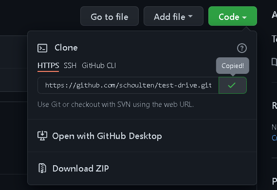
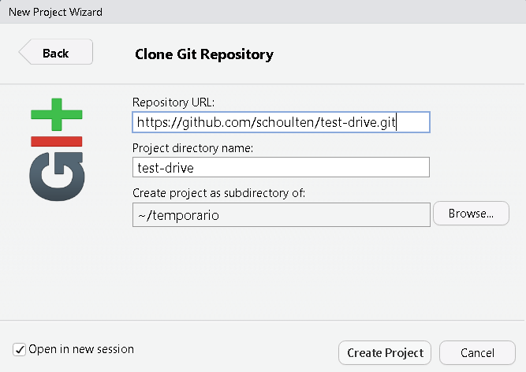
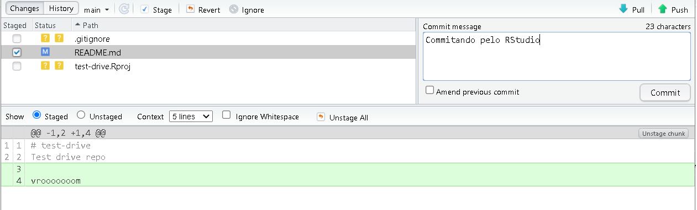

### Introdução

Neste tutorial você irá aprender a usar as melhores ferramentas de
controle de versão existentes diretamente no RStudio.

Este tutorial foi feito para quem:

-   Pretende utilizar pela primeira vez o Git e GitHub no RStudio;
-   Já é usuário de R;
-   Quer facilitar o fluxo de trabalho de ciência de dados com
    versionamento usando o Git.

### Pré requisitos

**Antes de começar**, certifique-se de que tenha:

-   Uma conta do GitHub criada: <https://github.com>;
-   R e RStudio instalados
    ([tutorial](https://happygitwithr.com/install-r-rstudio.html));
-   Git instalado
    ([tutorial](https://happygitwithr.com/install-git.html)).

Se algum desses requisitos estiverem faltando, você não conseguirá
conectar corretamente o RStudio com o Git e GitHub.

### Passo 1: configurar o Git

O primeiro procedimento é declarar para o Git quem você é, informando
seu nome e e-mail associado a sua conta do GitHub. Isso pode ser feito
de duas formas:

-   Pelo Terminal no RStudio, digite esses comandos substituindo seu
    nome/e-mail:

<!-- -->

    git config --global user.name 'Fernando da Silva'
    git config --global user.email 'fernando@email.com'

-   Usando o pacote *usethis*, no Console do RStudio:

``` r
library(usethis)
use_git_config(user.name = "Fernando da Silva", user.email = "fernando@email.com")
```

### Passo 2: criar um token do GitHub

Para a interação entre seu computador (mais especificamente o
repositório Git local) e o GitHub (repositório remoto) funcionar é
preciso de uma autenticação, certificando que você tem as permissões
necessárias para fazer o que quer que seja. Essa autenticação pode ser
facilmente implementada através da configuração de um token (também
conhecido como PAT) do GitHub.

Para criar o token, há duas formas:

-   Acesse <https://github.com/settings/tokens> e clique em “*Generate
    new token*”, selecionando os escopos desejados (recomenda-se
    selecionar *repo, user,* e *workflow*)

-   Ou, no Console do RStudio:

``` r
usethis::create_github_token()
```

Clique em “*Generate token*” e copie o código do token gerado (ao fechar
a página não será possível visualizá-lo novamente).

Com o token em mãos, use o pacote *gitcreds* para armazenar o token no
*Git credential store*, que é algo parecido como um arquivo de “cache”
de algum site ou botão “lembrar senha” que é usado toda vez que você
fizer interações entre o repositório local e o remoto.

Após executar o comando abaixo, cole o token obtido anteriormente:

``` r
gitcreds::gitcreds_set()
```

### Passo 3: test drive

Agora você já tem tudo pronto para testar se está funcionando. Se você
fizer o teste a seguir e não obter erros, significa que seu RStudio está
corretamente conectado com o Git e GitHub.

O “test drive” a seguir serve basicamente para verificar se a interação
entre RStudio, Git e GitHub está bem configurada. Para essa averiguação,
criaremos um repositório no GitHub, faremos o *clone* do mesmo para o
computador local, iremos gerar alterações locais, salvar e “commitar”,
e, por fim, enviar as alterações locais para o repositório remoto
(“push”).

**3.1) Criar um repositório no GitHub**

Acesse <https://github.com> e certifique-se de estar conectado. Próximo
de “Repositories”, clique no botão verde “New”. Na nova página preencha
o nome do repositório e descrição (use sua criatividade). Marque as
opções *Public* e *Add a README file* e, por fim, clique em “Create
repository”.

Após criar o repositório você será direcionado para a página do mesmo no
GitHub. Agora clique no botão verde que diz “Code” e copie a URL que
aparece na opção HTTPS (recomendado).



**3.2) Clonar repositório pelo RStudio**

Há duas formas de realizar o *clone* do repositório no RStudio, ambas
criam um novo projeto local com o repositório GitHub em questão:

-   Navegue por `File > New Project > Version Control > Git` e cole a
    URL do GitHub em “*Repository URL*”. Mantenha o campo “*Project
    directory name*” inalterado e escolha um local (pasta) onde o
    projeto será criado. Além disso, é importante marcar a opção “*Open
    in new session*”. Por fim, clique em “*Create Project*”.



-   Ou, é possível fazer esse mesmo procedimento pelo Console usando o
    pacote `usethis`. Com uma simples função, basta indicar o nome de
    usuário (que criou o repositório) e nome do repositório:

``` r
usethis::create_from_github("schoulten/test-drive")
```

Após clonar o repositório, você deverá estar em um novo projeto do
RStudio que conterá o repositório do GitHub. No painel Files do RStudio
procure o arquivo *README.md* e abra o mesmo no próprio RStudio.

**3.3) Fazer alterações locais, salvar, commitar**

Adicione uma linha com uma frase (use sua criatividade) no arquivo
*README.md* e salve essa alteração. Agora faça o *commit* dessas
alterações no seu repositório local:

-   Clique na painel “*Git*” do RStudio;
-   Clique no botão “*Commit*”;
-   Marque a caixinha ao lado de README.md na coluna “*Staged*”;
-   Em “*Commit message*” use sua criatividade novamente e digite uma
    mensagem;
-   Clique no botão “*Commit*”, aguarde mensagem de sucesso e clique em
    “*Close*”.



Se houverem outros arquivos no repositório criados automaticamente pelo
RStudio, deixe-os como estão.

**3.4) Enviar alterações (push) para o GitHub**

Clique no botão verde “*Push*” para enviar suas alterações realizadas no
repositório local para o repositório remoto (GitHub).

Se todas as etapas e configurações foram corretamente executadas, você
não deve ser perguntado para digitar o token e suas alterações locais
devem aparecer na página do repositório do GitHub (sugiro que atualize a
página para verificar)!

Se você chegou até aqui, a configuração do RStudio com o Git e GitHub
está concluída!

Ficou perdido ou não sabe o que é Git, versionamento, GitHub,
repositório, etc.? Comece lendo *Happy Git and GitHub for the useR* de
Jennifer Bryan para uma visão geral desse “mundinho”. O livro está
disponível gratuitamente e online:

<https://happygitwithr.com/>


<script type="text/javascript" src="https://cdnjs.buymeacoffee.com/1.0.0/button.prod.min.js" data-name="bmc-button" data-slug="schoulten" data-color="#40DCA5" data-emoji=""  data-font="Cookie" data-text="Buy me a coffee" data-outline-color="#000000" data-font-color="#ffffff" data-coffee-color="#FFDD00" ></script>
