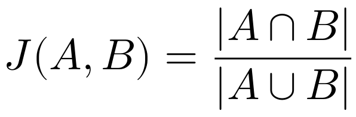
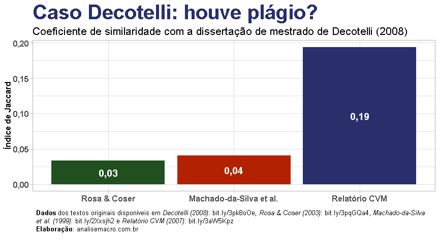

Detecção de plágio com NLP no R: o caso Decotelli
================
2021-10-23

### Introdução

*Natural Language Processing* (NLP) é um tópico interessante que vem
sendo bastante explorado no mundo da ciência de dados. No blog da
Análise Macro já explorei, por exemplo, [a mineração de textos (*text
mining*) das atas do
COPOM](https://analisemacro.com.br/data-science/analise-das-atas-do-copom-com-text-mining/)
(códigos disponíveis em `R`). No texto de hoje exploraremos mais o
assunto aplicado ao problema de detecção de plágio entre dois ou mais
textos, usando como exemplo um evento repercutido no ano passado
envolvendo o ex-Ministro da Educação, Carlos Decotelli.

Para contextualizar, e para quem não teve conhecimento do evento em
questão, em junho de 2020 [houveram
apontamentos](https://twitter.com/ThomasVConti/status/1276718086410944512)
de que a dissertação de mestrado do então Ministro da Educação, Carlos
Decotelli, continha indícios de plágio. Muitas notícias foram vinculadas
na época e após o “escândalo” o Ministro entregou uma [carta de
demissão](https://www.em.com.br/app/noticia/politica/2020/06/30/interna_politica,1161394/sem-tomar-posse-decotelli-deixa-ministerio-da-educacao-apos-falhas-no.shtml).

Dados os atores envolvidos e repercussão deste evento, **é natural aos
cientistas de dados se perguntarem se o plágio pode ser verificado** de
forma mais empírica. Neste texto faremos um exercício aplicado de R para
tentar responder essa questão, usando o pacote
[textreuse](https://docs.ropensci.org/textreuse/).

O pacote `textreuse` serve muito bem o propósito deste exercício, pois
fornece um conjunto de funções para **medir a similaridade entre
documentos** de texto e **detectar passagens que foram reutilizadas**.
Para realizar essa mensuração existem algumas possibilidades, entre elas
o **Índice de Jaccard** - também conhecido como coeficiente de
similaridade de Jaccard - que oferece uma estatística para medir a
similaridade entre conjuntos amostrais, expresso conforme abaixo:



O Índice de Jaccard é muito simples quando queremos identificar
similaridade entre textos, sendo os coeficientes expressos como números
entre 0 e 1. Dessa forma, quanto maior o número, mais semelhantes são os
textos (conjuntos amostrais).

Agora vamos à prática!

### Pacotes

Para reproduzir os código de R deste exercício, certifique de que tenha
os seguintes pacotes instalados/carregados:

``` r
# Carregar pacotes
library(textreuse) # CRAN v0.1.5
library(magrittr)  # CRAN v2.0.1
library(dplyr)     # CRAN v1.0.7
library(stringr)   # CRAN v1.4.0
library(ggplot2)   # CRAN v3.3.5
library(ggtext)    # CRAN v0.1.1
library(scales)    # CRAN v1.1.1
```

### Dados

Os dados utilizados são os documentos que queremos comparar a
similaridade. O principal documento é a dissertação de mestrado de
Carlos Decotelli, e os demais são documentos indicados por [Thomas
Conti](https://twitter.com/ThomasVConti/status/1276718086410944512) de
onde os trechos teriam sido copiados. Nos links à seguir você pode
baixar os originais de cada documento:

-   [Dissertação Carlos
    Decotelli](https://bibliotecadigital.fgv.br/dspace/handle/10438/3726)  
-   [Relatório CVM - The Internet
    Archive](http://web.archive.org/web/20200629224030/https://ri.banrisul.com.br/banrisul/web/arquivos/Banrisul_DFP2007b_port.pdf)  
-   [“A Abordagem Institucional na Administração” de Alexandre Rosa e
    Cláudia
    Coser](https://twiki.ufba.br/twiki/bin/viewfile/PROGESP/ItemAcervo241?rev=&filename=Abordagem_institucional_na_administracao.pdf)  
-   [“Mudança e estratégia nas organizações” de Clóvis L.
    Machado-da-Silva et
    al.](http://anpad.org.br/admin/pdf/enanpad1998-orgest-26.pdf)

Para usar esses documentos no pacote `textreuse` precisamos
transformá-los para o formato de texto (extensão .txt). Existem formas
de fazer isso por meio de pacotes no R, no entanto, para simplificar eu
usei ferramentas online que fazem esse serviço, tomando o cuidado de
remover as páginas pré ou pós textuais (capa, sumário, referências,
etc.) antes da conversão, já que o objetivo é comparar os textos do
corpo dos documentos propriamente ditos.

Ferramenta online para converter de PDF para TXT:
<https://pdftotext.com/pt/>

Após esse tratamento/conversão teremos 4 arquivos de texto para realizar
a análise. Disponibilizei os arquivos [neste
link](https://analisemacro.com.br/download/34322/) para quem se
interessar em reproduzir. Na sequência importamos os arquivos para o R:

``` r
# Criar pasta temporária
temp_folder <- tempdir()

# Baixar arquivos txt (zipados)
download.file(
  url      = "https://analisemacro.com.br/download/34322/",
  destfile = paste0(temp_folder, "\\decotelli.zip"),
  mode     = "wb" # talvez você precise mudar esse argumento, dependendo do seu sistema
  )

# Descompactar
unzip(
  zipfile = paste0(temp_folder, "\\decotelli.zip"), 
  exdir   = paste0(temp_folder, "txts")
  )

# Listar arquivos na pasta
list.files(paste0(temp_folder, "txts"), pattern = ".txt")
```

    ## [1] "clovis-p ginas-1-13.txt"    "cvm-p ginas-23-62.txt"     
    ## [3] "decotelli-p ginas-9-83.txt" "rosa-p ginas-1-13.txt"

``` r
# Importar arquivos (se arquivos não tiverem marcador "End of Line" será gerado um warning
corpus <- textreuse::TextReuseCorpus(      # cria uma estrutura Corpus (coleção de documentos)
  dir       = paste0(temp_folder, "txts"), # caminho para pasta com arquivos txt
  tokenizer = tokenize_ngrams,             # função para separar textos em tokens
  progress  = FALSE                        # não mostrar barra de progresso
  )
```

Se você tiver dificuldades em importar os dados, é possível explorar os
exemplos das
[*Vignettes*](https://docs.ropensci.org/textreuse/index.html) do pacote
também.

Agora vamos inspecionar o que temos no objeto `corpus`:

``` r
# Exibir resultado
corpus
```

    ## TextReuseCorpus
    ## Number of documents: 4 
    ## hash_func : hash_string 
    ## tokenizer : tokenize_ngrams

Verificando a classe do objeto:

``` r
# Classe
class(corpus)
```

    ## [1] "TextReuseCorpus" "Corpus"

Quais documentos/textos temos no objeto `corpus`?

``` r
# Documentos importados
names(corpus)
```

    ## [1] "clovis-p ginas-1-13"    "cvm-p ginas-23-62"      "decotelli-p ginas-9-83"
    ## [4] "rosa-p ginas-1-13"

E, similarmente, podemos acessar os elementos do objeto:

``` r
# Acessando texto da dissertação de mestrado
corpus[[3]]
```

    ## TextReuseTextDocument
    ## file : C:\Users\ferna\AppData\Local\Temp\Rtmp4QHWzGtxts/decotelli-p ginas-9-83.txt 
    ## hash_func : hash_string 
    ## id : decotelli-p ginas-9-83 
    ## minhash_func : 
    ## tokenizer : tokenize_ngrams 
    ## content : 1 – INTRODUÇÃO
    ## 
    ## A moeda é sem dúvida a principal invenção do homem na área das ciências sociais. Criada para
    ## facilitar as trocas, viabilizando a especialização do trabalho, a moeda é de s

Peceba que há problemas de `encoding`, que para este exercício iremos
simplesmente ignorar.

### Índice de Jaccard

Com os dados preparados, podemos obter a estatística do Índice de
Jaccard para medir a similaridade entre os textos, usando a função
`jaccard_similarity()`, que compara um texto A com um texto B. Queremos
fazer isso já para os 4, portanto usamos a função auxiliar
`pairwise_compare()` que reporta a estatística de cada documento
comparando a todos os demais (todos os pares possíveis), dentro do
objeto `corpus`:

``` r
# Coeficientes de similaridade de Jaccard
comparisons <- textreuse::pairwise_compare(
  corpus = corpus,               # objeto com textos importados
  f      = jaccard_similarity    # função para comparar os textos
  )

# Resultado
comparisons
```

    ##                        clovis-p ginas-1-13 cvm-p ginas-23-62
    ## clovis-p ginas-1-13                     NA        0.01308411
    ## cvm-p ginas-23-62                       NA                NA
    ## decotelli-p ginas-9-83                  NA                NA
    ## rosa-p ginas-1-13                       NA                NA
    ##                        decotelli-p ginas-9-83 rosa-p ginas-1-13
    ## clovis-p ginas-1-13                0.04087225        0.02439457
    ## cvm-p ginas-23-62                  0.19385437        0.01169428
    ## decotelli-p ginas-9-83                     NA        0.03302505
    ## rosa-p ginas-1-13                          NA                NA

O resultado de destaque mostra que o texto da dissertação de mestrado de
Carlos Decotelli (*decotelli-p ginas-9-83*) comparado com o texto do
relatório da CVM (*cvm-p ginas-23-62*) obteve um coeficiente de 0.19 (o
valor máximo vai até 1), bem superior aos demais. Esse resultado dialoga
com o que foi indicado por [Thomas
Conti](https://twitter.com/ThomasVConti/status/1276718086410944512) em
junho de 2020.

Vale frisar que existem outros métodos de comparação e funcionalidades
que o pacote oferece, consulte a
[documentação](https://docs.ropensci.org/textreuse/index.html).

Podemos facilmente converter o resultado, que é uma matriz, para um
`data frame` com a função `pairwise_candidates()`:

``` r
# Converter para data frame
comparisons_df <- textreuse::pairwise_candidates(comparisons)
comparisons_df
```

    ## # A tibble: 6 x 3
    ##   a                      b                       score
    ## * <chr>                  <chr>                   <dbl>
    ## 1 clovis-p ginas-1-13    cvm-p ginas-23-62      0.0131
    ## 2 clovis-p ginas-1-13    decotelli-p ginas-9-83 0.0409
    ## 3 clovis-p ginas-1-13    rosa-p ginas-1-13      0.0244
    ## 4 cvm-p ginas-23-62      decotelli-p ginas-9-83 0.194 
    ## 5 cvm-p ginas-23-62      rosa-p ginas-1-13      0.0117
    ## 6 decotelli-p ginas-9-83 rosa-p ginas-1-13      0.0330

Por fim, vamos criar uma visualização dos resultados:

``` r
comparisons_df %>% 
  dplyr::filter(
    stringr::str_detect(string = a, "decotelli") |
    stringr::str_detect(string = b, "decotelli")
    ) %>% 
  dplyr::mutate(a = c("Machado-da-Silva et al.", "Relatório CVM", "Rosa & Coser")) %>% 
  ggplot2::ggplot(ggplot2::aes(x = reorder(a, score), y = score, fill = a)) +
  ggplot2::geom_col() +
  ggplot2::geom_text(
    ggplot2::aes(
      label = format(round(score, 2), decimal.mark = ",", )
      ),
    position = ggplot2::position_stack(vjust = .5),
    color    = "white",
    fontface = "bold",
    size     = 5
  ) +
  ggplot2::scale_y_continuous(labels = scales::number_format(decimal.mark = ",", accuracy = 0.01)) +
  ggplot2::scale_fill_manual(NULL, values = c("#b22200", "#282f6b", "#224f20")) +
  ggplot2::theme_light() +
  ggplot2::labs(
    title    = "Caso Decotelli: houve plágio?",
    subtitle = "Coeficiente de similaridade com a dissertação de mestrado de Decotelli (2008)",
    y        = "Índice de Jaccard",
    x        = NULL,
    caption  = "<span style = 'font-size:10pt'>**Dados** dos textos originais disponíveis em *Decotelli (2008)*: bit.ly/3pk8oOe*, Rosa & Coser (2003)*: bit.ly/3pqGQa4, *Machado-da-Silva et al. (1999)*: bit.ly/2Xxsjh2 e *Relatório CVM (2007)*: bit.ly/3aW5Kpz<br>**Elaboração**: analisemacro.com.br</span>"
  ) +
  ggplot2::theme(
    legend.position = "none",
    axis.text       = ggtext::element_markdown(size = 12, face = "bold"),
    axis.title      = ggtext::element_markdown(size = 12, face = "bold"),
    plot.title      = ggtext::element_markdown(size = 30, face = "bold", colour = "#282f6b"),
    plot.subtitle   = ggtext::element_markdown(size = 16),
    plot.caption    = ggtext::element_textbox_simple(
      size       = 12,
      lineheight = 1,
      margin     = ggplot2::margin(10, 5.5, 10, 5.5)
      )
  )
```



O que achou? O pacote `textreuse` é bastante intuitivo e de fácil uso,
de modo que até quem não tem conhecimento aprofundado de estatística,
NLP, text mining, etc. consegue fazer análises simples como essa. Espero
que o exercício tenha ajudado!

### Referências

Recomenda-se consultar a documentação dos pacotes utilizados para
entendimento aprofundado sobre as funcionalidades.

-   Documentação do `textreuse`:
    <https://docs.ropensci.org/textreuse/index.html>
-   Jure Leskovec, Anand Rajaraman, and Jeff Ullman, Mining of Massive
    Datasets (Cambridge University Press, 2011).
