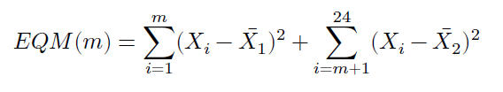
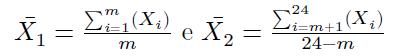

```{r setup, include=FALSE}
# Configurações dos chunks (outputs / saídas)
knitr::opts_chunk$set(
  echo       = TRUE,     # não mostrar código
  eval       = TRUE,     # executar o código
  fig.cap    = "",       # título do gráfico
  results    = "markup", # formato de renderização de texto
  fig.align  = "center", # alinhamento horizontal do gráfico
  out.width  = "100%",   # redimensionamento do gráfico (aumentar/diminuir em %)
  warning    = FALSE,    # exibir avisos do console?
  message    = FALSE,    # exibir mensagens do console?
  size       = "tiny"    # tamanho da fonte
  )
```


### Introdução

Ao analisar séries temporais pode ser útil identificar pontos de mudança em seu comportamento, utilizando métodos de detecção para tal. Existem diversos métodos e algoritmos para implementar esse tipo de análise, desde simples cálculos envolvendo erro quadrático médio até abordagens Bayesianas. Neste texto mostramos uma maneira simples de detectar pontos de mudança em uma série temporal com o método de Taylor (2000).

### Metodologia

O método desenvolvido por Taylor (2000), conforme mencionado, se baseia em um cálculo simples de erro quadrático médio (EQM) para identificar quando uma mudança na série ocorreu. A ideia geral é separar a série temporal em segmentos e calcular o EQM dos mesmos para identificar pontos de mudança, considerando o valor que minimiza o EQM. Formalmente:

```{r, echo=FALSE, out.width="50%"}

```

onde:

```{r, echo=FALSE, out.width="50%"}

```


### Exemplo no R

A implementação do método de detecção de pontos de mudança de média, desenvolvido por Taylor (2000), é feita recursivamente pelo pacote `ChangePointTaylor` no R.

Neste exemplo aplicamos o método para a série anual da Produtividade total dos fatores da economia brasileira, variável disponível no *dataset* da Penn World Table 10.0.

```{r, fig.width=9}
# Pacotes -----------------------------------------------------------------

library(ChangePointTaylor) # CRAN v0.1.1
library(pwt10)             # CRAN v10.0-0
library(dplyr)             # CRAN v1.0.7
library(tidyr)             # CRAN v1.1.4
library(ggplot2)           # CRAN v3.3.5
library(scales)            # CRAN v1.1.1
library(ggtext)            # CRAN v0.1.1


# Dados -------------------------------------------------------------------

# Tibble com dados da Produtividade total dos fatores - Brasil (2017 = 1)
tfp_br <- pwt10::pwt10.0 %>%
  dplyr::filter(isocode == "BRA") %>%
  dplyr::select(.data$year, .data$rtfpna) %>%
  tidyr::drop_na() %>%
  dplyr::as_tibble()

tfp_br


# Aplicar método de detecção de mudança (Taylor, 2000) --------------------

# Informar vetor de valores da série e
# vetor de nomes (usalmente a data correspondente ao valor)
change_points <- ChangePointTaylor::change_point_analyzer(
  x      = tfp_br$rtfpna,
  labels = tfp_br$year
  )

dplyr::as_tibble(change_points)


# Visualização de resultados ----------------------------------------------

# Gera gráfico ggplot2
tfp_br %>%
  ggplot2::ggplot(ggplot2::aes(x = year, y = rtfpna)) +
  ggplot2::geom_line(size = 2, color = "#282f6b") +
  ggplot2::geom_vline(
    xintercept = change_points$label,
    color      = "#b22200",
    linetype   = "dashed",
    size       = 1
  ) +
  ggplot2::scale_x_continuous(breaks = scales::extended_breaks(n = 20)) +
  ggplot2::scale_y_continuous(labels = scales::label_number(decimal.mark = ",", accuracy = 0.1)) +
  ggplot2::labs(
    title    = "Produtividade Total dos Fatores - Brasil",
    subtitle = "Preços nacionais constantes (2017 = 1)<br>Linhas tracejadas indicam pontos de mudança de média (Taylor, 2000)",
    y        = "PTF",
    x        = NULL,
    caption  = "**Dados**: Penn World Table 10.0 | **Elaboração**: Fernando da Silva"
  ) +
  ggplot2::theme_light() +
  ggplot2::theme(
    panel.grid       = ggplot2::element_blank(),
    axis.text        = ggtext::element_markdown(size = 12, face = "bold"),
    axis.title       = ggtext::element_markdown(size = 12, face = "bold"),
    plot.subtitle    = ggtext::element_markdown(size = 16, hjust = 0),
    plot.title       = ggtext::element_markdown(
      size   = 30,
      face   = "bold",
      colour = "#282f6b",
      hjust  = 0,
    ),
    plot.caption     = ggtext::element_textbox_simple(
      size   = 12,
      colour = "grey20",
      margin = ggplot2::margin(10, 5.5, 10, 5.5)
    )
  )
```


### Referências

Taylor, W. A. (2000). Change-point analysis: a powerful new tool for detecting changes.
