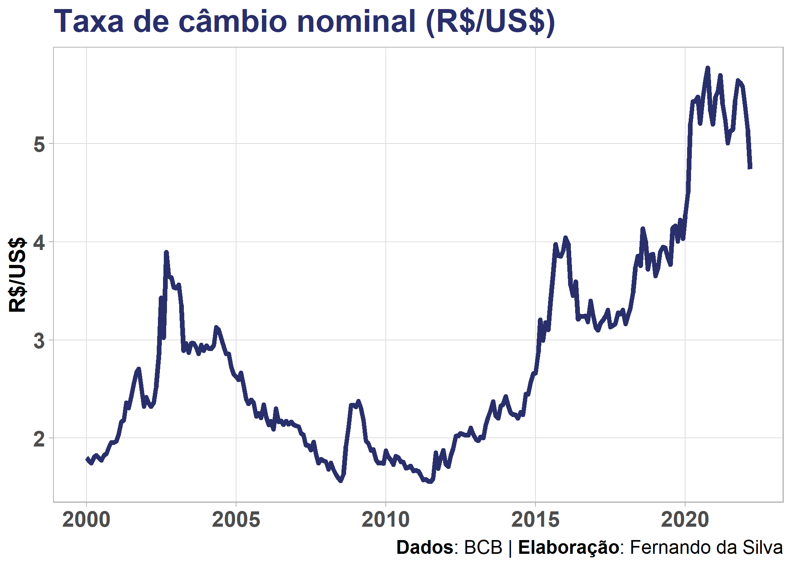
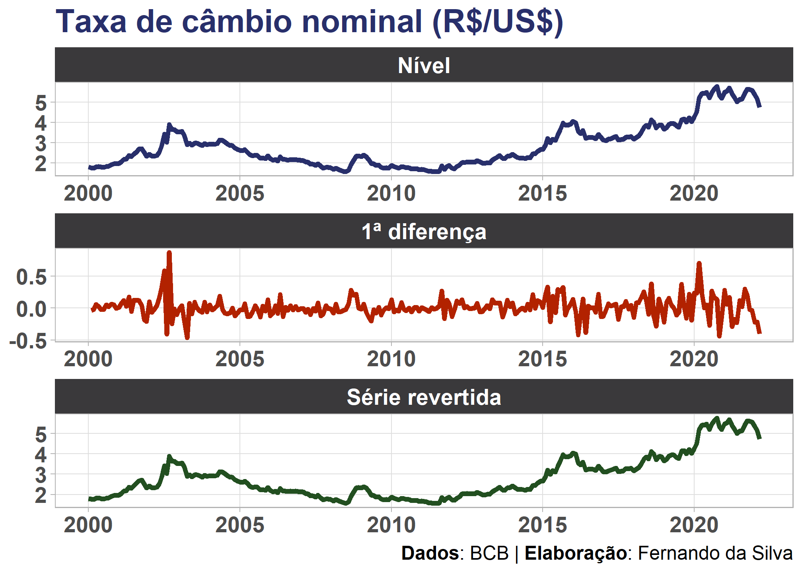

### Introdução

Modelagem de séries temporais frequentemente exige a aplicação de
transformações nas variáveis, tal como a bem conhecida [primeira
diferença](https://en.wikipedia.org/wiki/Recurrence_relation#first_difference).
Formalmente, podemos descrever essa transformação como:


Ou seja, dado uma série temporal regularmente espaçada, subtraímos do
valor em
 o
valor anterior
(),
obtendo a série dita “na primeira diferença” ou “nas diferenças”. Note
que a transformação implica na “perda” da primeira observação da série
temporal, ou seja, a série na primeira diferença possuirá

observações

A mudança de nível da série geralmente contorna diversas características
“não desejadas” pelo analista como tendência, sazonalidade, etc., mas
dificulta a interpretação dos valores - especialmente quando pretende-se
comunicá-los para públicos não técnicos. Para este objetivo é de grande
utilidade saber como diferenciar uma série temporal e, sobretudo, também
como reverter a transformação.

Para reverter a primeira diferença de uma série utilizamos a soma
cumulativa acrescentando a primeira observação da série original (em
nível), conforme:


Ou seja, no final teremos um vetor com a soma de cada valor em
 com
todos os anteriores, valores estes que neste caso podem representar a
série na primeira diferença que se deseja reverter.

### Exemplo no R

Para exemplificar, vamos aplicar um exercício simples no `R`, usando
dados reais do nosso dia a dia, com o objetivo de:

1.  Tomar a primeira de uma série
2.  Reverter a transformação para obter a série original.

Para esse exemplo você precisará dos seguintes pacotes:

``` r
library(magrittr)   # CRAN v2.0.1
library(GetBCBData) # CRAN v0.6
library(dplyr)      # CRAN v1.0.7
library(timetk)     # CRAN v2.6.2
library(tsibble)    # CRAN v1.0.1
library(tidyr)      # CRAN v1.1.4
```

Utilizaremos uma série conhecidamente não estacionária: a série mensal
da taxa de câmbio (R$/US$) nominal. Primeiro, importamos a série
diretamente do banco de dados do Banco Central (SGS/BCB) e tratamos os
dados para obter um `tibble`:

``` r
# Coleta da série temporal do Dólar no SGS/BCB
dados <- GetBCBData::gbcbd_get_series(
  id          = 3696, 
  first.date  = "2000-01-01",
  use.memoise = FALSE
  ) %>% 
  dplyr::select("date" = "ref.date", "value") %>% 
  dplyr::as_tibble()

# Resultado
dados
```

    ## # A tibble: 267 x 2
    ##    date       value
    ##    <date>     <dbl>
    ##  1 2000-01-01  1.80
    ##  2 2000-02-01  1.77
    ##  3 2000-03-01  1.75
    ##  4 2000-04-01  1.81
    ##  5 2000-05-01  1.83
    ##  6 2000-06-01  1.8 
    ##  7 2000-07-01  1.77
    ##  8 2000-08-01  1.82
    ##  9 2000-09-01  1.84
    ## 10 2000-10-01  1.91
    ## # ... with 257 more rows

Uma rápida visualização dos dados:



Para criar a série na primeira diferença usamos a função
`tsibble::difference`<sup>1</sup>, com seus argumentos padrão:

``` r
dados %<>%
  dplyr::mutate(value_diff = tsibble::difference(value))
dados
```

    ## # A tibble: 267 x 3
    ##    date       value value_diff
    ##    <date>     <dbl>      <dbl>
    ##  1 2000-01-01  1.80    NA     
    ##  2 2000-02-01  1.77    -0.0339
    ##  3 2000-03-01  1.75    -0.0212
    ##  4 2000-04-01  1.81     0.0594
    ##  5 2000-05-01  1.83     0.0199
    ##  6 2000-06-01  1.8     -0.0266
    ##  7 2000-07-01  1.77    -0.0252
    ##  8 2000-08-01  1.82     0.0486
    ##  9 2000-09-01  1.84     0.0203
    ## 10 2000-10-01  1.91     0.0653
    ## # ... with 257 more rows

Quando a diferença é aplicada inevitavelmente perdemos uma observação (a
primeira), sendo preenchida no objeto como um `NA`. Sendo assim, a
reversão dessa série para o seu nível (valores originais) pode ser feita
da seguinte forma: devemos substituir o valor `NA` pelo valor original
da série correspondente a esse período dos dados e, então, usar a função
`cumsum()` para calcular a soma cumulativa.

``` r
dados %<>%
  dplyr::mutate(
    value_diff   = dplyr::if_else(is.na(value_diff), value, value_diff),
    value_revert = cumsum(value_diff)
    )
dados
```

    ## # A tibble: 267 x 4
    ##    date       value value_diff value_revert
    ##    <date>     <dbl>      <dbl>        <dbl>
    ##  1 2000-01-01  1.80     1.80           1.80
    ##  2 2000-02-01  1.77    -0.0339         1.77
    ##  3 2000-03-01  1.75    -0.0212         1.75
    ##  4 2000-04-01  1.81     0.0594         1.81
    ##  5 2000-05-01  1.83     0.0199         1.83
    ##  6 2000-06-01  1.8     -0.0266         1.8 
    ##  7 2000-07-01  1.77    -0.0252         1.77
    ##  8 2000-08-01  1.82     0.0486         1.82
    ##  9 2000-09-01  1.84     0.0203         1.84
    ## 10 2000-10-01  1.91     0.0653         1.91
    ## # ... with 257 more rows

Checando se a série revertida corresponde aos valores originais:

``` r
identical(dados$value_revert, dados$value)
```

    ## [1] TRUE

Os cálculos ocorreram conforme o esperado: a série original da taxa de
câmbio importada do BCB é igual à série que aplicamos e revertemos a
primeira diferença.

Simples, não?

Por fim, vale comparar visualmente o comportamento da série em nível e
na diferença:



------------------------------------------------------------------------

<sup>1</sup> Para um equivalente em base R veja a documentação de `diff`
no R.


<script type="text/javascript" src="https://cdnjs.buymeacoffee.com/1.0.0/button.prod.min.js" data-name="bmc-button" data-slug="schoulten" data-color="#40DCA5" data-emoji=""  data-font="Cookie" data-text="Buy me a coffee" data-outline-color="#000000" data-font-color="#ffffff" data-coffee-color="#FFDD00" ></script>
