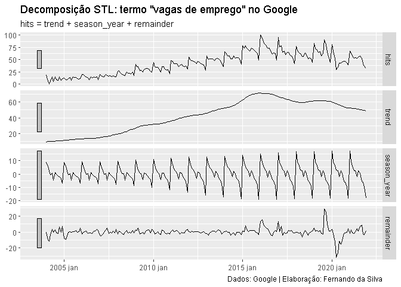

Como extrair componentes de tendência e sazonalidade de uma série
temporal
================
Fernando da Silva, Cientista de Dados
11 de dezembro de 2021

### Introdução

Tendência e sazonalidade são os componentes não observáveis de uma série
temporal que representam, respectivamente, o movimento de longo prazo e
o padrão regular (queda/subida) de um determinado período da série de
tempo. A extração desses componentes pode ser feita facilmente no R
usando a decomposição STL, método desenvolvido por Cleveland et
al. (1990).

Algumas vantagens desse método em relação aos métodos clássicos de
decomposição, como SEATS e X-11, são:

-   Ao contrário do SEATS e do X-11, a decomposição STL lida com
    qualquer tipo de sazonalidade, não apenas dados mensais e
    trimestrais;
-   O componente sazonal pode variar ao longo do tempo e a taxa de
    mudança pode ser definida pelo usuário;
-   A suavidade do componente tendência-ciclo também pode ser controlada
    pelo usuário;
-   É robusto em caso de outliers (ou seja, pode ser especificado uma
    decomposição robusta), de modo que observações incomuns não afetem
    as estimativas dos componentes, com exceção da série “restante”.

Em se tratando de séries de tempo econômicas, parece ser uma ótima opção
para diversos contextos, dado que a grande maioria das séries foram
afetadas pela pandemia da Covid-19 (além de outros choques *usuais* no
caso da economia brasileira).

Destaca-se ainda que o procedimento pode ser feito de maneira
completamente automatizada, graças ao belo trabalho da família de
pacotes `tidyverts`.

### Exemplo no R

Abaixo aplicamos a decomposição STL sobre a série temporal que traz a
popularidade do termo de busca “vagas de emprego” no Google. É esperado
que a série apresente de forma clara um padrão sazonal, dado o impulso
frequente de contratações de festas de fim de ano.

``` r
# Pacotes -----------------------------------------------------------------

# Carregar pacotes utilizados
library(magrittr)
library(dplyr)
library(gtrendsR)
library(tsibble)
library(fabletools)
library(feasts)
library(ggplot2)


# Coleta de dados ---------------------------------------------------------

# Primeiro coletamos os dados de exemplo provenientes do Google Trends
# de forma online usando API com o pacote gtrendsR

# Termo de busca "vagas de emprego" no Google; índice de 0 a 100 representa
# a popularidade relativa ao longo do tempo
df_vagas <- gtrendsR::gtrends(
  keyword      = "vagas de emprego",
  geo          = "BR",
  time         = "all",
  onlyInterest = TRUE
  )

# Exibir classe do objeto
class(df_vagas)
```

    ## [1] "gtrends" "list"

``` r
# Tratamento de dados -----------------------------------------------------

# Em seguida realizamos alguns tratamentos, selecionando e convertendo as
# colunas, além de transformar o objeto para classe tsibble
vagas <- df_vagas %>%
  magrittr::extract2(1) %>%
  dplyr::mutate(
    date  = tsibble::yearmonth(date),
    hits  = as.numeric(hits),
    .keep = "used"
  ) %>%
  tsibble::as_tsibble(index = date)


# Exibindo as primeiras linhas
vagas
```

    ## # A tsibble: 216 x 2 [1M]
    ##        date  hits
    ##       <mth> <dbl>
    ##  1 2004 jan    18
    ##  2 2004 fev     6
    ##  3 2004 mar     0
    ##  4 2004 abr     6
    ##  5 2004 mai    14
    ##  6 2004 jun     5
    ##  7 2004 jul    14
    ##  8 2004 ago     9
    ##  9 2004 set     7
    ## 10 2004 out    15
    ## # ... with 206 more rows

``` r
# Extrair componentes: sazonalidade e tendência ---------------------------

# Aplica modelo decomposição da série (STL decomposition) e transforma
# resultado para um objeto tabular de classe "dable"
componentes <- vagas %>%
  fabletools::model(feasts::STL(hits, robust = TRUE)) %>%
  fabletools::components()


# Exibir resultado
componentes
```

    ## # A dable: 216 x 7 [1M]
    ## # Key:     .model [1]
    ## # :        hits = trend + season_year + remainder
    ##    .model                   date  hits trend season_year remainder season_adjust
    ##    <chr>                   <mth> <dbl> <dbl>       <dbl>     <dbl>         <dbl>
    ##  1 feasts::STL(hits, r~ 2004 jan    18  9.40       8.71     -0.115         9.29 
    ##  2 feasts::STL(hits, r~ 2004 fev     6  9.55       6.11     -9.66         -0.105
    ##  3 feasts::STL(hits, r~ 2004 mar     0  9.70       1.87    -11.6          -1.87 
    ##  4 feasts::STL(hits, r~ 2004 abr     6  9.85      -0.574    -3.28          6.57 
    ##  5 feasts::STL(hits, r~ 2004 mai    14  9.99       0.530     3.48         13.5  
    ##  6 feasts::STL(hits, r~ 2004 jun     5 10.1       -4.62     -0.506         9.62 
    ##  7 feasts::STL(hits, r~ 2004 jul    14 10.3        1.29      2.45         12.7  
    ##  8 feasts::STL(hits, r~ 2004 ago     9 10.4       -0.225    -1.17          9.22 
    ##  9 feasts::STL(hits, r~ 2004 set     7 10.5       -1.41     -2.12          8.41 
    ## 10 feasts::STL(hits, r~ 2004 out    15 10.7       -1.78      6.12         16.8  
    ## # ... with 206 more rows

``` r
# Plotar resultado
fabletools::autoplot(componentes) +
  ggplot2::labs(
    title   = 'Decomposição STL: termo "vagas de emprego" no Google',
    x       = NULL,
    caption = "Dados: Google | Elaboração: Fernando da Silva"
  )
```



Os gráficos empilhados acima mostram, em primeiro, a série original do
Google Trends, seguida abaixo pelos componentes de tendência e
sazonalidade identificados automaticamente pelo método STL, além da
série “restante” que informa a variação restante dos dados não
identificada como sazonal ou tendencial.

Consulte a documentação de `feasts::STL` para detalhes sobre
especificação dos parâmetros e opções.

### Referências

R. B. Cleveland, W. S. Cleveland, J.E. McRae, and I. Terpenning (1990)
STL: A Seasonal-Trend Decomposition Procedure Based on Loess. Journal of
Official Statistics, 6, 3–73.

Hyndman, R.J., & Athanasopoulos, G. (2021) Forecasting: principles and
practice, 3rd edition, OTexts: Melbourne, Australia. OTexts.com/fpp3.
Accessed on &lt;2021-12-02&gt;.
